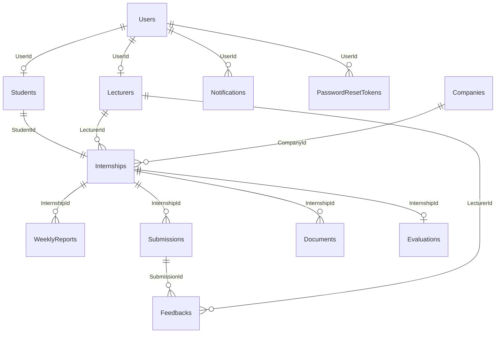

# InternLink — Database

**Version:** 1.2  
**DBMS:** Microsoft SQL Server  
**ORM:** Entity Framework Core 10 (code-first)  
**Status:** Active — aligned with Admin module (Phases 0–7)

---

## Tổng quan

InternLink dùng **12 bảng** nghiệp vụ (+ audit/soft-delete trên `BaseEntity`):

| # | Bảng | Mô tả ngắn |
|---|------|------------|
| 1 | `Users` | Tài khoản đăng nhập (SuperAdmin / Lecturer / Student) |
| 2 | `Lecturers` | Profile giảng viên |
| 3 | `Students` | Profile sinh viên (MSSV) |
| 4 | `Companies` | Doanh nghiệp thực tập |
| 5 | `Internships` | Hồ sơ thực tập (SV ↔ GV ↔ DN) |
| 6 | `WeeklyReports` | Báo cáo tuần |
| 7 | `Submissions` | Nộp bài / sản phẩm (versioning) |
| 8 | `Feedbacks` | Phản hồi GV trên Submission |
| 9 | `Evaluations` | Chấm điểm cuối kỳ |
| 10 | `Documents` | Tài liệu / biểu mẫu upload |
| 11 | `Notifications` | Thông báo in-app |
| 12 | `PasswordResetTokens` | Token quên mật khẩu (self-service) |

**Planned (chưa có bảng):** `InternshipLogs`

---

## Cấu trúc thư mục

```text
database/
├── README.md              ← File này
├── MIGRATIONS.md            ← Lịch sử EF migrations
├── diagrams/
│   └── erd.md               ← ERD (Mermaid)
└── scripts/
    ├── README.md            ← Hướng dẫn script SQL
    └── verify-schema.sql    ← Kiểm tra schema sau migrate
```

**Tài liệu chi tiết cột / kiểu dữ liệu:** [`docs/05c-Data-Dictionary.md`](../docs/05c-Data-Dictionary.md)

**Thiết kế & quy ước:** [`docs/05d-Database-Design.md`](../docs/05d-Database-Design.md)

**ERD (docs):** [`docs/05b-Entity-Relationship-Diagram.md`](../docs/05b-Entity-Relationship-Diagram.md)

---

## Quy ước đặt tên

| Lớp | Quy ước | Ví dụ |
|-----|---------|-------|
| Bảng SQL | PascalCase, số nhiều | `Students`, `Internships` |
| PK cột DB | `{Entity}Id` | `StudentId`, `UserId` |
| C# entity | `BaseEntity.Id` | map Fluent API → `{Entity}Id` |
| FK | `{ReferencedEntity}Id` | `LecturerId`, `CompanyId` |
| Enum | `int` trong DB, `string` ở API | `Role`, `InternshipStatus` |

---

## Chạy migration (khuyến nghị)

Migration được quản lý bởi EF Core trong `backend/InternLink/InternLink.Infrastructure/Migrations/`.

```bash
cd backend/InternLink

# Tạo / cập nhật database
dotnet ef database update --project InternLink.Infrastructure --startup-project InternLink.API

# Tạo migration mới (khi đổi entity)
dotnet ef migrations add <MigrationName> --project InternLink.Infrastructure --startup-project InternLink.API
```

**Connection string (Development):** `appsettings.Development.json` → LocalDB `InternLink`.

Seed dữ liệu demo chạy tự động khi API khởi động (`SeedData.InitializeAsync`).

---

## Seed credentials (demo)

| Username | Password | Role |
|----------|----------|------|
| `superadmin` | `Password123!` | SuperAdmin |
| `lecturer1` | `Password123!` | Lecturer |
| `student1` | `Password123!` | Student |

---

## Quan hệ chính



---

## Thay đổi gần đây (Admin module)

| Migration | Nội dung |
|-----------|----------|
| `AddMustChangePasswordToUsers` | `Users.MustChangePassword BIT NOT NULL DEFAULT 0` |
| `AddPasswordResetTokens` | Bảng token reset MK (hash SHA-256, expiry, one-time) |

Chi tiết: [`MIGRATIONS.md`](MIGRATIONS.md)

---

## Ghi chú vận hành

- **Soft delete:** `IsDeleted = 1` — không xóa vật lý trên bảng nghiệp vụ chính.
- **File upload:** DB chỉ lưu metadata (`FileName`, `FilePath`, `MimeType`); file thật ngoài SQL.
- **DN placeholder:** Khi Admin phân công SV→GV chưa có DN, internship dùng company hệ thống `Chưa phân công doanh nghiệp`.
- **Production:** không commit SMTP password; dùng environment variables / user secrets.
