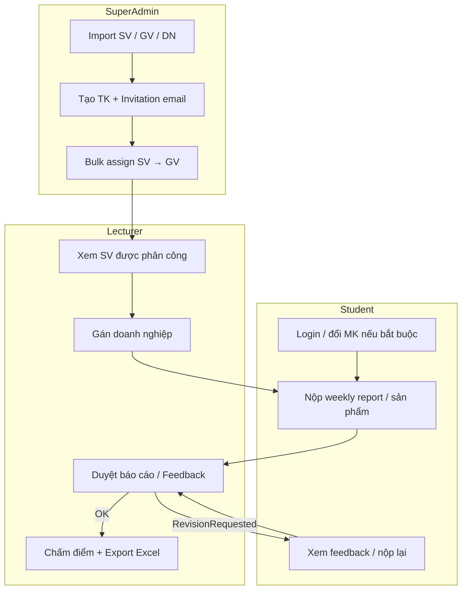

# Business Workflow

**Project:** InternLink – Internship Management & Collaboration Platform

**Version:** 2.0

**Status:** Active — aligned with MVP + SuperAdmin module

**Diagrams:** [`images/workflow/`](images/workflow/) · Sequences: [`images/sequence/`](images/sequence/)

---

# 1. Overview

Mô tả quy trình hướng dẫn thực tập **AS-IS** (thủ công) và **TO-BE** (với InternLink), gồm vai trò **SuperAdmin**, **Lecturer**, **Student**.

---

# 2. AS-IS Workflow (Current Process)

Công cụ: Excel, Zalo, Google Drive, Email, Word.

## Bước 1. Chuẩn bị

- Khoa/GV nhận danh sách SV (Excel).
- Cấp tài khoản / gửi mật khẩu thủ công (nếu có portal khác).
- Phân công GV hướng dẫn bằng Excel/email.
- Gửi biểu mẫu qua Zalo / Drive.

## Bước 2. Doanh nghiệp

- SV đăng ký DN; GV ghi nhận Excel.
- Thông tin DN không tập trung.

## Bước 3. Thực hiện

- SV gửi nhật ký / báo cáo / sản phẩm qua Zalo, Drive, Email.
- GV phản hồi Word/Zalo; nhiều phiên bản khó kiểm soát.

## Bước 4. Kết thúc

- Nộp hồ sơ cuối kỳ rải rác.
- GV chấm và tổng hợp Excel thủ công → nhập điểm hệ thống trường.

---

# 3. Existing Problems

| ID | Problem |
|----|---------|
| P1 | Thông tin phân tán |
| P2 | Khó theo dõi tiến độ từng SV |
| P3 | Khó xác định phiên bản báo cáo mới nhất |
| P4 | Khó quản lý / kế thừa DN |
| P5 | Tốn thời gian tổng hợp cuối kỳ |
| P6 | Cấp TK + phân công GV thủ công, dễ sai |

---

# 4. TO-BE Workflow (With InternLink)

## Swimlane tổng quan

---

## Bước 0. Vận hành Admin (mới so với v1)

| Ai | Việc |
|----|------|
| SuperAdmin | Import / CRUD Students, Lecturers, Companies |
| SuperAdmin | Tạo User + gửi invitation (username + MK tạm) |
| SuperAdmin | `POST /api/Admin/assignments` — gán SV → GV |
| Hệ thống | Tạo Internship stub nếu chưa có; DN placeholder nếu chưa gán DN |

**Ranh giới:** chỉ SuperAdmin đổi `LecturerId`. Lecturer **không** gọi `/api/Admin/*`.

Sequence: [`bulk-assign.md`](images/sequence/bulk-assign.md) · [`invitation-email.md`](images/sequence/invitation-email.md)

---

## Bước 1. Sinh viên / Giảng viên vào hệ thống

- Login JWT; nếu `MustChangePassword` → đổi MK.
- Quên MK: email link reset (self-service).

Sequence: [`forgot-password.md`](images/sequence/forgot-password.md)

---

## Bước 2. Gán doanh nghiệp (Lecturer)

- Lecturer xem DN (read-only master data).
- `PUT /api/Internship/{id}/company` trên internship mình phụ trách.
- Upload / công bố tài liệu biểu mẫu.

---

## Bước 3. Theo dõi tiến độ & nộp bài

| Student | Lecturer | Hệ thống |
|---------|----------|----------|
| Nộp Weekly Report | Review + comment | Status workflow |
| Nộp Submission / sản phẩm | Feedback, yêu cầu sửa | Version history |
| Resubmit | Duyệt lại | Notifications |

---

## Bước 4. Kết thúc đợt

- Student nộp báo cáo / sản phẩm cuối (nếu yêu cầu).
- Lecturer Evaluation (4 tiêu chí) → Finalize.
- Export Excel cuối kỳ (`GET /api/Lecturer/export/end-of-term`).

---

# 5. Responsibility Matrix (RACI rút gọn)

| Hoạt động | SuperAdmin | Lecturer | Student |
|-----------|------------|----------|---------|
| Import master data | **R** | — | — |
| Cấp TK + email mời | **R** | — | — |
| Phân công SV→GV | **R** | C (nhận SV) | — |
| Gán DN cho internship | — | **R** | C |
| Nộp báo cáo | — | A (duyệt) | **R** |
| Feedback / chấm điểm | — | **R** | I |
| Export cuối kỳ | — | **R** | — |
| Forgot password | — | **R** (self) | **R** (self) |

R = Responsible, A = Accountable (duyệt), C = Consulted, I = Informed

---

# 6. Workflow Comparison

| AS-IS | TO-BE (InternLink) |
|-------|---------------------|
| Excel danh sách SV/GV | Admin import + DB |
| Gửi MK qua Zalo/email lẻ | Invitation / reset email chuẩn |
| Phân công GV bằng Excel | Bulk assign API |
| DN trong Excel | Company master + assign company |
| Báo cáo Zalo/Drive | Submission + WeeklyReport |
| Comment Word | Feedback + version |
| Tổng hợp Excel tay | Evaluation + Export Excel |

Diagram so sánh: [`images/workflow/workflow-comparison.md`](images/workflow/workflow-comparison.md)

---

# 7. Business Value

| Stakeholder | Giá trị |
|-------------|---------|
| SuperAdmin | Vận hành tập trung: data, TK, phân công |
| Lecturer | Chỉ làm nghiệp vụ hướng dẫn trên SV được giao |
| Student | Một cổng nộp bài + feedback + tự reset MK |
| Khoa | Company DB + dữ liệu kế thừa |

---

# 8. Summary

TO-BE MVP gồm **bốn** khối quy trình:

1. **Admin ops** — import, TK, email, assign  
2. **Company assign** — Lecturer gán DN  
3. **Progress & feedback** — nộp / duyệt / sửa  
4. **Evaluation & export** — chấm + Excel  

Chi tiết UC: [`04-Use-Case-Specification.md`](04-Use-Case-Specification.md)
