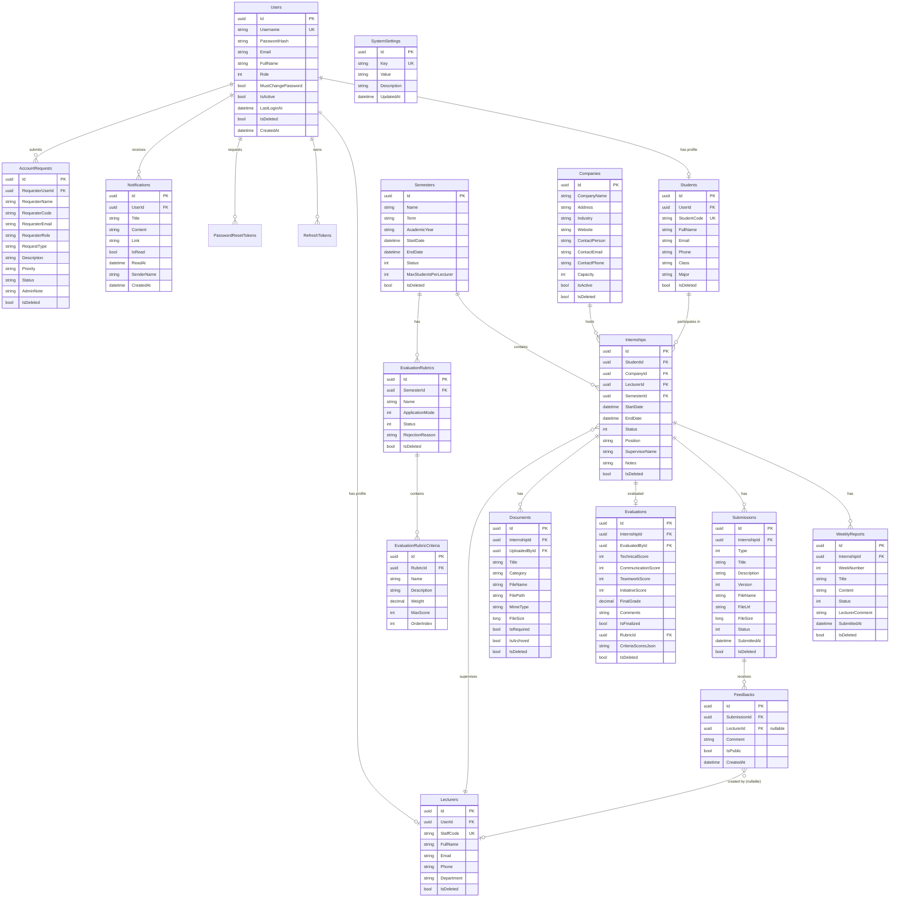

# InternLink — Sơ Đồ Thực Thể Quan Hệ (Entity Relationship Diagram)

**Dự án:** InternLink — Nền tảng Quản lý và Giám sát Thực tập Tốt nghiệp  
**Phiên bản:** 4.0  
**Ngày cập nhật:** Tháng 9/2026

---

## 1. Sơ Đồ ERD Chi Tiết (18 Bảng)

---

## 2. Ràng Buộc Khóa Ngoại

| Bảng | Khóa ngoại | REFERENCES | On Delete |
|:---|:---|:---|:---|
| `Students` | `UserId` | `Users(Id)` | Set Null |
| `Lecturers` | `UserId` | `Users(Id)` | Set Null |
| `Internships` | `StudentId` | `Students(Id)` | Restrict |
| `Internships` | `LecturerId` | `Lecturers(Id)` | Set Null |
| `Internships` | `CompanyId` | `Companies(Id)` | Set Null |
| `Internships` | `SemesterId` | `Semesters(Id)` | Restrict |
| `WeeklyReports` | `InternshipId` | `Internships(Id)` | Cascade |
| `Submissions` | `InternshipId` | `Internships(Id)` | Cascade |
| `Feedbacks` | `SubmissionId` | `Submissions(Id)` | Cascade |
| `Feedbacks` | `LecturerId` | `Lecturers(Id)` | Set Null |
| `Evaluations` | `InternshipId` | `Internships(Id)` | Cascade |
| `EvaluationRubrics` | `SemesterId` | `Semesters(Id)` | Restrict |
| `EvaluationRubricCriteria` | `RubricId` | `EvaluationRubrics(Id)` | Cascade |
| `Documents` | `InternshipId` | `Internships(Id)` | Set Null |
| `Notifications` | `UserId` | `Users(Id)` | Cascade |
| `AccountRequests` | `RequesterUserId` | `Users(Id)` | Set Null |
