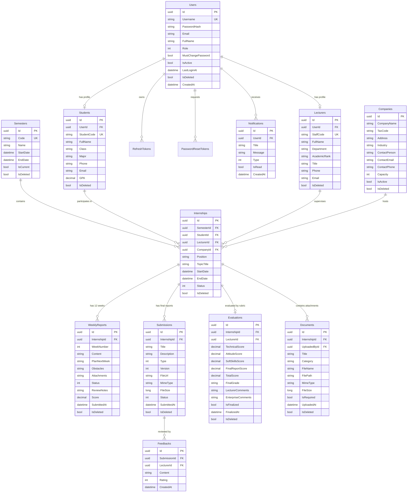

# InternLink — Sơ Đồ Thực Thể Quan Hệ (Entity Relationship Diagram - ERD)

**Dự án:** InternLink — Nền tảng Quản lý và Giám sát Thực tập Tốt nghiệp  
**Phiên bản:** 3.0  
**Ngày cập nhật:** Tháng 8/2026

---

## 1. Sơ Đồ ERD Chi Tiết (Mermaid Diagram)

---

## 2. Ràng Buộc Khóa Ngoại & Tính Toàn Vẹn Tham Chiếu (Foreign Key Constraints)

1. **`Internships`**:
   - `FK_Internships_Semesters`: `SemesterId` $\rightarrow$ `Semesters(Id)` (Restricted Delete).
   - `FK_Internships_Students`: `StudentId` $\rightarrow$ `Students(Id)` (Restricted Delete).
   - `FK_Internships_Lecturers`: `LecturerId` $\rightarrow$ `Lecturers(Id)` (Null on Delete).
   - `FK_Internships_Companies`: `CompanyId` $\rightarrow$ `Companies(Id)` (Null on Delete).
2. **`WeeklyReports`**:
   - `FK_WeeklyReports_Internships`: `InternshipId` $\rightarrow$ `Internships(Id)` (Cascade Delete / Soft Delete).
   - Index duy nhất: `(InternshipId, WeekNumber)` để bảo đảm mỗi sinh viên chỉ có 1 báo cáo cho mỗi tuần.
3. **`Evaluations`**:
   - `FK_Evaluations_Internships`: `InternshipId` $\rightarrow$ `Internships(Id)` (Unique 1:1).
