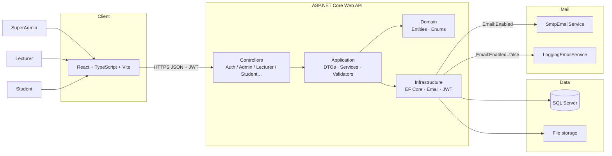

# System Architecture

**Project:** InternLink – Internship Management & Collaboration Platform

**Version:** 2.0

**Status:** Active — aligned with MVP + SuperAdmin + Email

**Diagrams:** [`images/architecture/`](images/architecture/)

---

# 1. Overview

InternLink dùng kiến trúc **Client–Server** + backend **4-layer**.

Thành phần chính:

- Frontend (React)
- Backend (ASP.NET Core Web API)
- Database (SQL Server)
- Email (SMTP hoặc Logging stub)

---

# 2. High-Level Architecture



Canonical Mermaid: [`images/architecture/overall-architecture.md`](images/architecture/overall-architecture.md)

---

# 3. Technology Stack

| Layer | Technology |
|--------|------------|
| Frontend | React, TypeScript, Vite, Tailwind |
| Backend | ASP.NET Core Web API (.NET 10) |
| ORM | Entity Framework Core |
| Database | SQL Server / LocalDB |
| Auth | JWT Bearer |
| Email | MailKit (SMTP) / LoggingEmailService |
| Docs API | Swagger / OpenAPI |
| Tests | xUnit + Moq + FluentAssertions |

---

# 4. Frontend Architecture

Page-based (planned / in progress):

```text
src/
├── pages/          # Admin | Lecturer | Student portals
├── layouts/
├── services/       # Axios + JWT
├── routes/         # role guards
└── …
```

Client lưu JWT; gửi `Authorization: Bearer`. Nếu `MustChangePassword` → redirect đổi MK.

---

# 5. Backend Architecture (4 layers)

```text
InternLink.API            Controllers, middleware, Swagger
        │
InternLink.Application    DTOs, interfaces, validators, mappings
        │
InternLink.Domain         Entities, enums (no framework deps)
        │
InternLink.Infrastructure EF Core, Email, JWT, Seed, Services impl
```

### API surface (groups)

| Group | Route prefix | Policy |
|-------|--------------|--------|
| Auth | `/api/Auth` | Anonymous / Authorize |
| Admin | `/api/Admin/*` | `RequireAdmin` (SuperAdmin) |
| Lecturer workflow | `/api/Lecturer`, … | `RequireLecturer` |
| Student / shared | `/api/WeeklyReport`, … | Role-specific |
| Master read | `/api/Student`, `/api/Company` | Lecturer (read-only) |

Chi tiết: [`Backend-Plan.md`](Backend-Plan.md)

---

# 6. Database Architecture

- 12 bảng nghiệp vụ (+ `__EFMigrationsHistory`)
- Soft delete + audit trên `BaseEntity`
- Migrations code-first

Xem: [`database/README.md`](../database/README.md) · [`05d-Database-Design.md`](05d-Database-Design.md)

---

# 7. Authentication & Authorization

1. `POST /api/Auth/login` → JWT + `Role` + `MustChangePassword`
2. Client gắn Bearer token
3. Policies:

| Policy | Role |
|--------|------|
| `RequireAdmin` / `RequireSuperAdmin` | SuperAdmin |
| `RequireLecturer` | Lecturer only |
| `RequireStudent` | Student only |

Password: ASP.NET Identity hasher.  
Reset token: SHA-256 hash trong `PasswordResetTokens`.

---

# 8. Email Architecture

| Setting | Behavior |
|---------|----------|
| `Email:Enabled=true` | `SmtpEmailService` (MailKit) |
| `Email:Enabled=false` | `LoggingEmailService` → Serilog (dev) |

Templates:

- Invitation (username + temp password)
- Admin password reset notification
- Forgot-password **link only**

Config: `PortalUrl`, `PasswordResetPath`, `InstitutionName`, SMTP credentials (secrets).

---

# 9. Request Flow

```text
React → Controller → Application Service → Infrastructure (EF / Email)
                         ↓
                    Domain entities
                         ↓
                    SQL Server / SMTP
```

Sequence chi tiết: [`images/architecture/request-lifecycle.md`](images/architecture/request-lifecycle.md)

---

# 10. Security

- JWT + role policies
- Password hashing; reset token hashing + expiry + one-time
- Không trả mật khẩu tạm trong JSON
- Soft delete; SuperAdmin protected trên Admin Users API
- Input validation (FluentValidation)
- HTTPS (production)

---

# 11. File Storage

DB chỉ metadata (`FileName`, `FilePath`/`FileUrl`, `MimeType`, `FileSize`).  
Binary trên filesystem (hoặc object storage sau này).

---

# 12. Deployment

### Development

```text
React (Vite)  →  http://localhost:5173
API           →  http://localhost:7109  (+ Swagger)
SQL Server    →  LocalDB InternLink
Email         →  LoggingEmailService
```

### Production (target)

```text
Browser → Static React → ASP.NET Core → SQL Server
                              ↓
                         SMTP (Email:Enabled=true)
```

Secrets qua environment / user secrets — không commit.

Deployment notes: [`images/architecture/deployment-architecture.md`](images/architecture/deployment-architecture.md)

---

# 13. Future Architecture

| Item | Status |
|------|--------|
| Email Service | ✅ Implemented |
| Notification (in-app) | ✅ Implemented |
| Hangfire / mail queue | Planned |
| AI services | Future |
| Docker / cloud storage | Future |

---

# 14. Architecture Principles

- Separation of Concerns / SRP
- Layered + RESTful
- Policy-based authorization (Admin ≠ Lecturer)
- Config-driven email
- Migrations as schema source of truth

---

# 15. Summary

Kiến trúc MVP hỗ trợ đủ 3 portal (Admin / Lecturer / Student), JWT, email invitation & reset, và EF Core SQL Server — sẵn sàng gắn frontend.
