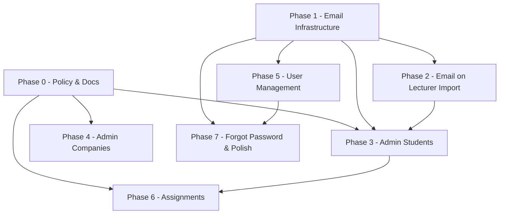

# Kế hoạch triển khai SuperAdmin (Admin Module)

**Project:** InternLink  
**Version:** 1.0  
**Ngày lập:** 2026-08-11  
**Trạng thái:** Chờ triển khai theo từng nhóm — nghiệm thu từng phase trước khi sang phase tiếp theo

---

## 1. Mục tiêu nghiệp vụ

SuperAdmin là **quản trị viên hệ thống** (phòng/khoa), **không** thay thế Giảng viên trong nghiệp vụ hàng ngày.

| Trách nhiệm Admin | Không thuộc Admin |
|-------------------|-------------------|
| Import danh sách SV, GV, DN | Duyệt báo cáo, gửi feedback |
| Cấp / quản lý tài khoản SV, GV | Chấm điểm, finalize evaluation |
| Gửi email mời tham gia (link + username + password) | Export Excel cuối kỳ (GV) |
| Phân công SV cho GV | Theo dõi tiến độ SV được phân công |

**Nguyên tắc phân quyền:**

- `RequireAdmin` → chỉ role `SuperAdmin`
- `RequireLecturer` → chỉ role `Lecturer` (giữ nguyên, không gộp SuperAdmin)
- `RequireStudent` → chỉ role `Student`

---

## 2. Ma trận phân quyền đích (sau khi hoàn thành tất cả nhóm)

| Module | GET (xem) | POST/PUT/DELETE / Import |
|--------|-----------|--------------------------|
| LecturerProfile | SuperAdmin, Lecturer | SuperAdmin |
| Students (master data) | SuperAdmin | SuperAdmin |
| Companies (master data) | SuperAdmin, Lecturer* | SuperAdmin |
| Internships (phân công) | SuperAdmin | SuperAdmin |
| Users (tài khoản) | SuperAdmin | SuperAdmin |
| Lecturer workflow | — | Lecturer |
| Submission / Evaluation / WeeklyReport review | — | Lecturer / Student |

\* Lecturer cần **đọc** danh sách DN khi gán thực tập — chỉ mở GET, không mở write.

---

## 3. Cách làm việc

1. Triển khai **một nhóm (Phase)** tại một thời điểm.
2. Chạy `dotnet build` + `dotnet test`.
3. Báo cáo kết quả theo mẫu ở cuối mỗi phase.
4. **Bạn nghiệm thu** (Swagger / Postman / DB) → quyết định có tiếp tục phase tiếp theo.

**Quy ước báo cáo sau mỗi phase:**

```markdown
## Báo cáo Phase X — [Tên]
- Trạng thái: Hoàn thành / Có vấn đề
- Build: pass/fail
- Tests: X/Y pass
- Endpoint mới / đổi policy: ...
- Cách kiểm tra nhanh: ...
- Ghi chú / rủi ro: ...
```

---

## Phase 0 — Nền tảng phân quyền & tài liệu

**Mục tiêu:** Chuẩn hóa policy, không đổi hành vi nghiệp vụ lớn.

### Công việc

| # | Task | File / vị trí |
|---|------|---------------|
| 0.1 | Thêm policy `RequireAdmin` (= `SuperAdmin`) | `InternLink.Infrastructure/DependencyInjection.cs` |
| 0.2 | Giữ `RequireSuperAdmin` (alias hoặc dùng chung implementation) để không break code cũ |同上 |
| 0.3 | Cập nhật `docs/05a-Domain-Model.md` — mô tả rõ vai trò SuperAdmin | docs |
| 0.4 | Cập nhật `docs/Backend-Plan.md` — link tới plan này, sửa mục "SuperAdmin truy cập RequireLecturer" | docs |

### Không làm ở phase này

- Không đổi policy các controller hiện có.
- Không thêm API mới.

### Tiêu chí nghiệm thu

- [x] Build pass, tests pass (44+).
- [x] Policy `RequireAdmin` đăng ký trong DI.
- [x] Docs phản ánh đúng mô hình Admin vs Lecturer.

### Effort ước tính

~30 phút — chủ yếu docs + 2 dòng policy.

---

## Phase 1 — Hạ tầng Email

**Mục tiêu:** Có service gửi mail + template mời tham gia (môi trường giáo dục), chạy được ở dev (log) và production (SMTP).

### Công việc

| # | Task | Chi tiết |
|---|------|----------|
| 1.1 | Package MailKit | `InternLink.Infrastructure.csproj` |
| 1.2 | `EmailSettings` | Host, Port, SSL, From, PortalUrl, InstitutionName, SupportEmail, Enabled |
| 1.3 | `IEmailService` + DTO | `Application/Interfaces/IEmailService.cs`, `InvitationEmailRequest` |
| 1.4 | `SmtpEmailService` | Gửi HTML + plain text qua MailKit |
| 1.5 | `LoggingEmailService` | Dev: `Email:Enabled=false` → log nội dung mail ra Serilog |
| 1.6 | `InvitationEmailTemplate` | Template SV / GV — tiếng Việt, tone trường học |
| 1.7 | Config | `appsettings.json`, `appsettings.Development.json` |
| 1.8 | DI registration | Chọn implementation theo `Email:Enabled` |
| 1.9 | Unit tests | Render template, validate subject/body có username + portalUrl |

**Template — trường bắt buộc trong email:**

- Họ tên người nhận
- Vai trò (Sinh viên / Giảng viên)
- Link hệ thống (`PortalUrl`)
- Username
- Mật khẩu tạm thời
- Lời nhắc đổi mật khẩu lần đầu
- Thông tin liên hệ hỗ trợ

### API tạm (chỉ Phase 1 — test)

| Method | Path | Policy | Mục đích |
|--------|------|--------|----------|
| POST | `/api/Admin/email/test` | RequireAdmin | Gửi mail test tới địa chỉ chỉ định |

> Controller `AdminController` hoặc `AdminEmailController` — dùng lại ở các phase sau.

### Tiêu chí nghiệm thu

- [x] `Email:Enabled=false` → log mail trong console/file, không crash.
- [ ] `Email:Enabled=true` + SMTP hợp lệ → nhận được mail test. *(cần SMTP thật khi nghiệm thu)*
- [x] Nội dung mail đúng format giáo dục (template unit-tested).
- [x] Tests pass cho template builder.

### Effort ước tính

~2–3 giờ.

---

## Phase 2 — Email mời tham gia khi tạo Giảng viên

**Mục tiêu:** Hook email vào luồng **đã có** — tạo/import GV + tạo User.

### Phụ thuộc

- Phase 1 hoàn thành.

### Công việc

| # | Task | Chi tiết |
|---|------|----------|
| 2.1 | Gửi mail sau `EnsureLecturerUserAsync` | `LecturerProfileService.cs` — user mới tạo |
| 2.2 | Gửi mail sau import Excel (có Username + Email) | Cùng service — batch, đếm success/fail |
| 2.3 | Mở rộng `LecturerImportResultDto` | `EmailSentCount`, `EmailFailedCount`, `EmailErrors[]` |
| 2.4 | Không gửi nếu thiếu email | Ghi warning trong `Errors`, vẫn tạo user |
| 2.5 | Không log plaintext password | Chỉ gửi qua email |
| 2.6 | Unit tests | Mock `IEmailService`, verify gọi đúng lúc |

### Tiêu chí nghiệm thu

- [x] `POST /api/LecturerProfile` + Username + Email → mail/log invitation.
- [x] `POST /api/LecturerProfile/import` → result có số mail sent/failed.
- [x] Import thiếu Email → tạo GV + user OK, `EmailSentCount=0`, có message cảnh báo.
- [x] `lecturer1` import vẫn không được (policy SuperAdmin) — không đổi.

### Kiểm tra Swagger

1. Login `superadmin`.
2. Import file GV mẫu có Username + Email.
3. Xem response + log/mailbox.

### Effort ước tính

~2 giờ.

---

## Phase 3 — Quản lý Sinh viên (Admin) + tài khoản + email

**Mục tiêu:** Admin import/tạo SV, tạo User login, gửi email mời — **tách khỏi Lecturer**.

### Phụ thuộc

- Phase 1, 2 (pattern email đã proven).

### Công việc

| # | Task | Chi tiết |
|---|------|----------|
| 3.1 | Tách endpoint Admin | **Option A (khuyến nghị):** `AdminStudentsController` route `/api/Admin/students` — tránh break API cũ. **Option B:** đổi policy `StudentController` → RequireAdmin (breaking). |
| 3.2 | `EnsureStudentUserAsync` | Giống GV: Username → User role Student, password mặc định |
| 3.3 | Cột `Username` trong import Excel | Header: `Username`, `TenDangNhap`, … |
| 3.4 | Gửi invitation email | Sau create user mới |
| 3.5 | Mở rộng `StudentImportResultDto` | EmailSentCount, EmailFailedCount |
| 3.6 | Cập nhật template Excel import | Thêm cột Username + ghi chú |
| 3.7 | `StudentController` (Lecturer) | **Gỡ** hoặc **Thu hẹp** — Lecturer không quản lý master SV; chỉ xem SV qua `LecturerController` / internship |
| 3.8 | Tests | Import + create user + mock email |

### API đích (`AdminStudentsController`)

| Method | Path | Mô tả |
|--------|------|-------|
| GET | `/api/Admin/students` | Danh sách + phân trang |
| POST | `/api/Admin/students/search` | Lọc MSSV, lớp, ngành |
| GET | `/api/Admin/students/{id}` | Chi tiết |
| POST | `/api/Admin/students` | Tạo SV (+ optional Username → tạo User) |
| PUT | `/api/Admin/students/{id}` | Cập nhật |
| DELETE | `/api/Admin/students/{id}` | Soft delete (chặn nếu có internship) |
| GET | `/api/Admin/students/import/template` | Template Excel |
| POST | `/api/Admin/students/import` | Import + tạo user + email |

Policy: `[Authorize(Policy = "RequireAdmin")]` toàn controller.

### Tiêu chí nghiệm thu

- [x] `superadmin` import SV có Username + Email → User + Student + mail/log.
- [x] `lecturer1` gọi `/api/Admin/students` → 403.
- [x] `lecturer1` vẫn xem SV được phân công qua workflow GV (không bị break).
- [x] Import trùng MSSV → báo lỗi như hiện tại.

### Effort ước tính

~4–5 giờ.

---

## Phase 4 — Quản lý Doanh nghiệp (Admin) + Import Excel

**Mục tiêu:** Admin CRUD + import DN; Lecturer chỉ đọc (phục vụ gán thực tập).

### Phụ thuộc

- Phase 0 (policy).

### Công việc

| # | Task | Chi tiết |
|---|------|----------|
| 4.1 | `AdminCompaniesController` | `/api/Admin/companies` — CRUD + search |
| 4.2 | Import Excel DN | Cột: TenDN, Nganh, NguoiLienHe, Email, SDT, DiaChi, SucChua, … |
| 4.3 | Template + result DTO | Giống pattern SV/GV |
| 4.4 | `CompanyController` | Đổi thành `[Authorize(Roles = "SuperAdmin,Lecturer")]` **GET only**; write → 403 Lecturer hoặc chuyển hết write sang Admin |
| 4.5 | Tests | Import, duplicate CompanyName |

### API đích

| Method | Path | Policy |
|--------|------|--------|
| GET/POST search | `/api/Admin/companies` | RequireAdmin |
| POST import | `/api/Admin/companies/import` | RequireAdmin |
| GET (read only) | `/api/Company` | SuperAdmin, Lecturer |

### Tiêu chí nghiệm thu

- [x] Admin import 10 DN từ Excel.
- [x] Lecturer GET `/api/Company` → OK.
- [x] Lecturer POST `/api/Company` → 403 (write đã chuyển sang Admin).

### Effort ước tính

~3–4 giờ.

---

## Phase 5 — Quản lý tài khoản (User Management)

**Mục tiêu:** Admin CRUD user, reset MK, khóa/mở TK, gửi email khi cấp/reset.

### Phụ thuộc

- Phase 1 (email).

### Công việc

| # | Task | Chi tiết |
|---|------|----------|
| 5.1 | Migration `Users.MustChangePassword` | BIT, default true cho user mới |
| 5.2 | `IUserManagementService` | List, Get, Create, Update, Deactivate, ResetPassword |
| 5.3 | `AdminUsersController` | `/api/Admin/users` |
| 5.4 | Create user | Role Student/Lecturer + link profile nếu có StudentCode/StaffCode |
| 5.5 | Reset password | Sinh password tạm → hash → gửi email (template khác: "Mật khẩu mới") |
| 5.6 | Login check | Nếu `MustChangePassword=true` → response flag (frontend redirect đổi MK) |
| 5.7 | Tests | Create, reset, deactivate |

### API đích

| Method | Path | Mô tả |
|--------|------|-------|
| GET | `/api/Admin/users` | Danh sách (filter role, active) |
| GET | `/api/Admin/users/{id}` | Chi tiết |
| POST | `/api/Admin/users` | Tạo TK + email invitation |
| PUT | `/api/Admin/users/{id}` | Sửa FullName, Email, IsActive |
| POST | `/api/Admin/users/{id}/reset-password` | Reset + email |
| DELETE | `/api/Admin/users/{id}` | Soft delete (ràng buộc nghiệp vụ) |

### Tiêu chí nghiệm thu

- [x] Admin tạo user Lecturer → nhận email invitation.
- [x] Admin reset password → user login được với MK mới, `MustChangePassword=true`.
- [x] Deactivate user → login fail.
- [x] Không expose password trong API response.

### Effort ước tính

~4–5 giờ.

**Triển khai:** `UserManagementService`, `AdminUsersController` (`/api/Admin/users`), migration `AddMustChangePasswordToUsers`, `PasswordResetEmailTemplate`, login/`change-password` trả về/xóa flag `MustChangePassword`.

---

## Phase 6 — Phân công Sinh viên → Giảng viên

**Mục tiêu:** Admin gán nhiều SV cho một GV (bulk assignment).

### Phụ thuộc

- Phase 3 (SV master data), Lecturer profile đã có.

### Công việc

| # | Task | Chi tiết |
|---|------|----------|
| 6.1 | `IAssignmentService` | Bulk assign logic |
| 6.2 | `AdminAssignmentsController` | `/api/Admin/assignments` |
| 6.3 | Logic nghiệp vụ | Với mỗi `studentId`: nếu chưa có Internship → tạo stub (status NotStarted, chưa có Company); nếu có → cập nhật `LecturerId` |
| 6.4 | Validation | GV tồn tại, SV tồn tại, không duplicate assignment conflict |
| 6.5 | `InternshipController` write | Giữ RequireLecturer **hoặc** chuyển assign sang Admin only — thống nhất: **Admin phân công GV**, Lecturer chỉ gán DN (`assign company`) |
| 6.6 | Tests | Bulk 5 SV → 1 GV, re-assign |

### API đích

| Method | Path | Body | Mô tả |
|--------|------|------|-------|
| POST | `/api/Admin/assignments` | `{ lecturerId, studentIds[] }` | Gán hàng loạt |
| GET | `/api/Admin/assignments/by-lecturer/{lecturerId}` | — | Xem SV của GV |
| DELETE | `/api/Admin/assignments` | `{ lecturerId, studentId }` | Gỡ phân công (set LecturerId null) |

### Tiêu chí nghiệm thu

- [x] Admin gán 3 SV cho `lecturer1` → lecturer login thấy 3 SV trong workflow.
- [x] Re-assign SV sang GV khác → lecturer cũ không còn thấy.
- [x] Lecturer không gọi được `/api/Admin/assignments`.

### Effort ước tính

~3–4 giờ.

**Triển khai:** `AssignmentService`, `AdminAssignmentsController` (`/api/Admin/assignments`), stub internship với DN placeholder `Chưa phân công doanh nghiệp`; Lecturer không đổi `LecturerId` qua `InternshipController`.

---

## Phase 7 — Forgot/Reset password & hoàn thiện

**Mục tiêu:** Luồng quên MK tự phục vụ + cập nhật artifacts.

### Phụ thuộc

- Phase 1, 5.

### Công việc

| # | Task | Chi tiết |
|---|------|----------|
| 7.1 | Token reset password | Bảng `PasswordResetTokens` hoặc claim + expiry |
| 7.2 | `ForgotPasswordAsync` | Gửi link reset qua email (không gửi password plaintext) |
| 7.3 | `ResetPasswordAsync` | Validate token → đặt MK mới |
| 7.4 | Cập nhật `AuthController` | Bỏ stub throw |
| 7.5 | Export `swagger.json` + Postman | Admin endpoints |
| 7.6 | Cập nhật `Backend-Plan.md` | Trạng thái Admin module complete |
| 7.7 | Smoke test checklist | File test scenarios |

### Tiêu chí nghiệm thu

- [x] SV request forgot-password → nhận email link.
- [x] Reset qua link → login OK.
- [x] Full regression: 69+ tests pass, build 0 errors.

### Effort ước tính

~3–4 giờ.

**Triển khai:** `PasswordResetTokens`, `ForgotPasswordEmailTemplate`, `AuthService` forgot/reset, cập nhật Postman + swagger export + smoke test checklist.

---

## 4. Tổng quan phụ thuộc



**Thứ tự triển khai đề xuất:**  
`0 → 1 → 2 → 3 → 4 → 5 → 6 → 7`

Phase 4 có thể song song Phase 3 nếu cần — không phụ thuộc lẫn nhau.

---

## 5. Thay đổi Database dự kiến

| Phase | Migration | Bảng / cột |
|-------|-----------|------------|
| 5 | `AddMustChangePasswordToUsers` | `Users.MustChangePassword BIT NOT NULL DEFAULT 0` |
| 7 | `AddPasswordResetTokens` | `PasswordResetTokens` (Token, UserId, ExpiresAt, UsedAt) |

Không đổi schema SV/GV/DN ngoài User flags.

---

## 6. Cấu hình môi trường

### Development (`appsettings.Development.json`)

```json
{
  "Email": {
    "Enabled": false,
    "PortalUrl": "http://localhost:5173",
    "InstitutionName": "Trường Đại học Demo",
    "SupportEmail": "daotao@demo.edu.vn"
  }
}
```

### Production

- `Email:Enabled=true`
- SMTP credentials qua environment variables / user secrets — **không commit** password.

---

## 7. Rủi ro & quyết định cần xác nhận trước Phase 3

| # | Câu hỏi | Đề xuất mặc định |
|---|---------|------------------|
| 1 | Giữ `/api/Student` cho Lecturer hay gỡ hẳn? | Tạo `/api/Admin/students`, deprecate `/api/Student` write; Lecturer chỉ xem qua workflow |
| 2 | Mật khẩu mặc định cố định hay random mỗi user? | Random 12 ký tự — an toàn hơn |
| 3 | Gửi password qua email — có bắt buộc đổi MK lần đầu? | Có — `MustChangePassword=true` (Phase 5) |
| 4 | Import bulk 500 SV — gửi mail tuần tự hay background job? | Phase 3: tuần tự + delay 100ms; Phase 7+: Hangfire nếu cần |

---

## 8. Effort tổng ước tính

| Phase | Effort |
|-------|--------|
| 0 | 0.5h |
| 1 | 2–3h |
| 2 | 2h |
| 3 | 4–5h |
| 4 | 3–4h |
| 5 | 4–5h |
| 6 | 3–4h |
| 7 | 3–4h |
| **Tổng** | **~22–28h** |

---

## 9. Trạng thái theo dõi

| Phase | Tên | Trạng thái | Ngày nghiệm thu |
|-------|-----|------------|----------------|
| 0 | Policy & Docs | ✅ Hoàn thành | 2026-08-11 |
| 1 | Email Infrastructure | ✅ Hoàn thành | 2026-08-11 |
| 2 | Email + Lecturer Import | ✅ Hoàn thành | 2026-08-11 |
| 3 | Admin Students | ✅ Hoàn thành | 2026-08-11 |
| 4 | Admin Companies | ✅ Hoàn thành | 2026-08-12 |
| 5 | User Management | ✅ Hoàn thành | 2026-08-12 |
| 6 | Assignments SV→GV | ✅ Hoàn thành | 2026-08-12 |
| 7 | Forgot Password & Polish | ✅ Hoàn thành | 2026-08-12 |

---

**Admin module hoàn tất** — tất cả 8 phase (0–7) đã triển khai.

---

*Tài liệu này là baseline — cập nhật cột "Trạng thái" sau mỗi phase nghiệm thu.*
