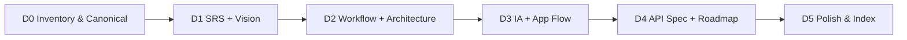

# Kế hoạch hoàn thiện Documentation

**Project:** InternLink  
**Version:** 1.0  
**Ngày lập:** 2026-08-12  
**Mục tiêu:** Đưa toàn bộ docs từ “một phần sync với code” → **Active, khớp MVP + Admin module**  
**Ước lượng tổng:** ~10–14 giờ (chia 5 phase)

---

## 1. Hiện trạng (baseline)

| Nhóm | % khớp code | Ghi chú |
|------|-------------|---------|
| Domain / DB / UC / Admin / Sequence | **~95%** | Vừa cập nhật (v1.2–2.0) |
| SRS / Workflow / Architecture / IA / API Spec / Roadmap | **~40–60%** | Vẫn Draft hoặc thiếu SuperAdmin |
| `backend/docs/*` | **Rủi ro** | Bản copy / pointer — dễ lệch `docs/` |
| Frontend UI guidelines | **N/A** | Chưa bắt buộc nếu chưa làm UI |

**Docs đủ cho dev:** ~90%  
**Docs đủ cho báo cáo/đồ án:** ~65–70% ← mục tiêu kế hoạch này: **≥90%**

---

## 2. Nguyên tắc làm việc

1. **Một phase / lần** — cập nhật → review → đánh dấu Active → mới sang phase sau.
2. **Source of truth:**
   - API thực tế → `api/swagger.json` + controllers
   - Domain/DB → `05a–05d` + `database/`
   - UC → `04-Use-Case-Specification.md`
3. **Không viết lại toàn bộ** nếu chỉ thiếu SuperAdmin — patch incremental.
4. **`docs/` là canonical**; `backend/docs/` chỉ giữ pointer hoặc xóa duplicate.
5. Mỗi phase có checklist nghiệm thu ngắn.

---

## 3. Thứ tự phase (đề xuất)



**Thứ tự logic:** yêu cầu → quy trình → kiến trúc/UI info → API → đóng gói.

---

## Phase D0 — Inventory & Canonical (0.5–1h)

**Mục tiêu:** Dọn nguồn tài liệu, tránh 2 bản lệch nhau.

| # | Task |
|---|------|
| D0.1 | Rà soát `backend/docs/*` vs `docs/*` — giữ pointer hoặc xóa duplicate |
| D0.2 | Cập nhật `docs/README.md`: bảng trạng thái từng doc (Draft / Active / Deprecated) |
| D0.3 | Thêm `docs/DOCS-STATUS.md` (matrix ngắn: file → version → last sync) |

**Nghiệm thu**

- [ ] Không còn 2 bản “full content” khác nhau cho cùng một doc
- [ ] README liệt kê đủ file quan trọng + link diagram

**Effort:** ~0.5–1h

---

## Phase D1 — SRS + Vision Scope (2–3h)

**Mục tiêu:** Yêu cầu phản ánh 3 actors + Admin module.

### Files

- `docs/01-Vision-Scope.md`
- `docs/02-Software-Requirements-Specification.md`

### Công việc

| # | Task |
|---|------|
| D1.1 | Intended users: SuperAdmin / Lecturer / Student |
| D1.2 | Scope MVP: thêm admin (import, cấp TK, email, phân công SV→GV, forgot password) |
| D1.3 | Functional requirements mới: FR-Admin-* (map sang UC-Axx) |
| D1.4 | Non-functional: email SMTP, JWT, MustChangePassword, soft delete |
| D1.5 | Out of scope rõ: InternshipLog, Analytics nâng cao, Hangfire (nếu chưa làm) |
| D1.6 | Version → 2.0, Status → **Active** |

**Nghiệm thu**

- [ ] SRS không còn “chỉ 2 user”
- [ ] Mỗi FR Admin map được sang UC trong `04`
- [ ] Out of scope khớp `Backend-Plan` §8

**Effort:** ~2–3h

---

## Phase D2 — Business Workflow + System Architecture (2–3h)

**Mục tiêu:** TO-BE workflow có Admin; architecture có email + Admin API.

### Files

- `docs/03-Business-Workflow.md`
- `docs/06-System-Architecture.md`
- `docs/images/workflow/to-be-workflow.md` (cập nhật nếu cần)
- `docs/images/architecture/overall-architecture.md` (bổ sung Email)

### Công việc

| # | Task |
|---|------|
| D2.1 | TO-BE: thêm bước Admin chuẩn bị (import SV/GV/DN → tạo TK → email → assign GV) |
| D2.2 | Làm rõ ranh giới: Admin phân công GV; Lecturer gán DN + duyệt/chấm |
| D2.3 | Architecture: Auth + Email service + `/api/Admin/*` |
| D2.4 | Deployment note: `Email:Enabled`, LocalDB, JWT |
| D2.5 | Version Active |

**Nghiệm thu**

- [ ] Workflow có nhánh SuperAdmin
- [ ] Architecture diagram nhắc Email (SMTP / Logging)
- [ ] Không mâu thuẫn với sequence đã có

**Effort:** ~2–3h

---

## Phase D3 — Information Architecture + Application Flow (2–3h)

**Mục tiêu:** Sitemap / navigation có portal Admin (dù frontend chưa làm).

### Files

- `docs/07a-Information-Architecture.md`
- `docs/07b-Application-Flow.md`
- `docs/images/information-architecture/sitemap.md`
- `docs/images/application-flow/` — thêm 2–3 flow Admin

### Công việc

| # | Task |
|---|------|
| D3.1 | Roles = 3; sitemap thêm `/admin/*` (students, companies, users, assignments) |
| D3.2 | Navigation Admin vs Lecturer vs Student (bảng quyền màn hình) |
| D3.3 | Application flows mới (Mermaid): |
| | — Admin import SV + invitation |
| | — Admin bulk assign |
| | — User forgot password |
| D3.4 | Link tới sequence diagrams đã có (tránh trùng nội dung) |
| D3.5 | Đánh dấu flow Lecturer “Manage Students/Companies” = **read-only / deprecated write** |

**Nghiệm thu**

- [ ] Sitemap có SuperAdmin
- [ ] Flow cũ không còn mô tả Lecturer CRUD master data như quyền chính
- [ ] 3 flow Admin mới tồn tại hoặc link sequence

**Effort:** ~2–3h

---

## Phase D4 — API Spec + Roadmap (2–3h)

**Mục tiêu:** API Spec không drift; Roadmap phản ánh thực tế.

### Files

- `docs/08-API-Specification.md`
- `docs/10-Roadmap.md`
- `api/swagger.json` / `api/postman_collection.json` (export lại nếu API đổi)

### Công việc

| # | Task |
|---|------|
| D4.1 | Base URL → `http://localhost:7109/api` (khớp swagger local) |
| D4.2 | Thêm section **Admin APIs** (`/api/Admin/students|companies|users|assignments|email`) |
| D4.3 | Auth: forgot/reset password, `MustChangePassword` trong login response |
| D4.4 | Policy matrix: RequireAdmin / RequireLecturer / RequireStudent |
| D4.5 | Ghi rõ: **canonical OpenAPI = `api/swagger.json`**; markdown là overview |
| D4.6 | Roadmap: đánh dấu Backend MVP + Admin **Done**; Frontend next; InternshipLog backlog |
| D4.7 | Version Active |

**Nghiệm thu**

- [ ] Không thiếu module Admin trong API Spec
- [ ] Không list endpoint đã xóa / sai policy
- [ ] Roadmap khớp Backend-Plan

**Effort:** ~2–3h

---

## Phase D5 — Polish & Closure (1–2h)

**Mục tiêu:** Đóng gói, dễ onboard.

| # | Task |
|---|------|
| D5.1 | `docs/README.md`: bảng trạng thái final + “đọc theo thứ tự” |
| D5.2 | Cross-link: Vision → SRS → UC → Domain → DB → Arch → API |
| D5.3 | Kiểm tra broken links nội bộ |
| D5.4 | (Optional) 1 trang `docs/ONBOARDING.md` — 15 phút đọc để chạy API |
| D5.5 | Commit + push; cập nhật % docs trong Backend-Plan nếu cần |

**Nghiệm thu**

- [ ] Mọi doc chính Status = Active (trừ intentionally Planned)
- [ ] Người mới theo README chạy được swagger trong 15 phút
- [ ] Docs báo cáo ≥90% khớp code

**Effort:** ~1–2h

---

## 4. Không làm trong kế hoạch này (tránh scope creep)

| Item | Lý do |
|------|--------|
| Viết lại toàn bộ application-flow Lecturer/Student | Đã đủ; chỉ sửa chỗ lệch quyền |
| UI/UX Guidelines chi tiết pixel | Để khi làm frontend |
| Class diagram UML đầy đủ | Domain + ERD đủ |
| Sync `backend/docs` thành bản full thứ hai | Chỉ pointer |
| Docs tiếng Anh song ngữ | Không bắt buộc MVP |

---

## 5. Tracking

| Phase | Tên | Effort | Trạng thái |
|-------|-----|--------|------------|
| D0 | Inventory & Canonical | 0.5–1h | ✅ 2026-08-12 |
| D1 | SRS + Vision | 2–3h | ✅ 2026-08-12 |
| D2 | Workflow + Architecture | 2–3h | ✅ 2026-08-12 |
| D3 | IA + App Flow | 2–3h | ✅ 2026-08-12 |
| D4 | API Spec + Roadmap | 2–3h | ✅ 2026-08-12 |
| D5 | Polish & Closure | 1–2h | ✅ 2026-08-12 |
| **Tổng** | | **~10–14h** | **D0–D5 DONE** |

**Thứ tự chạy:** `D0 → D1 → D2 → D3 → D4 → D5`

---

## 6. Definition of Done (toàn bộ docs)

1. Không còn doc “core” Status = Draft (trừ ghi chú Planned features).
2. SuperAdmin xuất hiện nhất quán ở SRS, Workflow, IA, UC, Architecture, API.
3. API Spec không mâu thuẫn Swagger; có link OpenAPI/Postman.
4. `docs/README` là mục lục + trạng thái + thứ tự đọc.
5. Commit message rõ theo phase hoặc 1 commit tổng kết cuối D5.

---

## 7. Đề xuất bắt đầu

**Bắt đầu Phase D0 + D1** (inventory + SRS) — impact cao nhất cho báo cáo, effort vừa.

Sau mỗi phase: báo cáo ngắn (giống Admin module):

```markdown
## Báo cáo Docs Phase Dx — [Tên]
- Trạng thái: Hoàn thành
- Files đổi: ...
- Version / Status: ...
- Ghi chú: ...
```

---

## Báo cáo Docs Phase D4 — API Spec + Roadmap
- Trạng thái: Hoàn thành
- Files: `08-API-Specification.md` v2, `10-Roadmap.md` v2
- Canonical API: `api/swagger.json`

## Báo cáo Docs Phase D5 — Polish
- Trạng thái: Hoàn thành
- Files: `ONBOARDING.md`, README/DOCS-STATUS/plan closure
- Docs program D0–D5: **DONE** (~90%+ khớp MVP)

---

*Baseline: 2026-08-12 — sau Admin module + UC/sequence/database docs sync.*
*Closed: 2026-08-12 — D0–D5 complete.*
