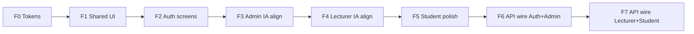

# Frontend — Kế hoạch chuẩn hóa UI & hoàn thiện màn hình

**Project:** InternLink  
**Version:** 1.0  
**Ngày:** 2026-08-13  
**Mục tiêu:** Giảm cảm giác AI-generic (bo góc / card / indigo-glow), căn UI với IA + backend MVP, chia phase nhỏ để làm dần.

**Hiện trạng nhanh**

| Khía cạnh | Thực tế |
|-----------|---------|
| Stack | React 19 + Vite + Tailwind 4 |
| Portal | Admin / Lecturer / Student — shell + MVP screens |
| API | Gắn backend `:7109` (mock tắt mặc định; bật qua `VITE_USE_MOCK`) |
| Style | Nhiều `rounded-2xl`, shadow, gradient card, indigo/purple, glass, bento |
| Docs IA | [`07a-Information-Architecture.md`](07a-Information-Architecture.md) |

---

## 1. Nguyên tắc UI (chuẩn hóa)

### 1.1 Radius — giảm “viên thuốc”

| Token | Giá trị đề xuất | Dùng cho |
|-------|-----------------|----------|
| `--il-radius-sm` | `4px` (`rounded`) | Chip nhỏ, input compact |
| `--il-radius-base` | `6px` (`rounded-md`) | Button, input, table cell |
| `--il-radius-panel` | `8px` (`rounded-lg`) | Panel / section (thay `rounded-2xl`) |
| `--il-radius-modal` | `10px` | Modal / drawer |

**Cấm mặc định:** `rounded-2xl`, `rounded-3xl`, `rounded-full` trên khối lớn (chỉ còn avatar / status dot).

### 1.2 Card — khi nào được dùng

| Được dùng card | Không dùng card |
|----------------|-----------------|
| Modal / dialog tương tác | Mỗi KPI một “hộp bóng” tách biệt |
| Panel chính chứa bảng / form | Nested card trong card |
| Empty state có CTA | Sidebar item, filter bar, list row |
| | Header toolbar |

**Ưu tiên layout:**

- Section = `border-b` hoặc khoảng trắng (`gap` / `space-y`), không phải box trắng + shadow.
- Bảng: surface phẳng, hairline border `#e2e8f0`.
- List row: hover nền nhẹ, không border-radius lớn từng dòng.

### 1.3 Tránh AI-generic look

- Bỏ / giảm: indigo→purple gradient, glow shadow, glass blur trên dashboard, mesh login quá đậm.
- Font: giữ Plus Jakarta / Space Grotesk OK — nhưng **đừng** mọi tiêu đề đều “font-black + tracking tight + indigo”.
- Màu nhấn: **một** accent chính (navy/blue khoa), semantic xanh/đỏ/vàng chỉ cho status.
- Motion: tối đa subtle; bỏ hover `translateY` trên mọi card.

### 1.4 Surface hierarchy

```text
Page bg     → slate-50 / #f8fafc (phẳng)
Section     → transparent + spacing
Primary panel → white + 1px border (không shadow hoặc shadow cực nhẹ)
Interactive → hover:bg-slate-50
```

---

## 2. Inventory màn hình hiện có vs cần có

### 2.1 Public / Auth

| Màn hình | FE hiện có | Backend | Gap |
|----------|------------|---------|-----|
| Login | ✅ `LoginPortal` | ✅ | Gắn API JWT thật |
| Forgot password | ❌ | ✅ | **Thiếu UI** |
| Reset password | ❌ | ✅ | **Thiếu UI** |
| Change password / MustChangePassword gate | Một phần Account | ✅ | Gate `/change-password` sau login |

---

### 2.2 SuperAdmin (`/admin`)

| Màn hình (IA) | FE hiện có | Gap |
|---------------|------------|-----|
| Dashboard ops | ✅ Task list + workload + timeline | ✅ API (`useAdminDashboardStats`) |
| Students CRUD + import | ✅ `StudentsView` (table-first) | ✅ CRUD + cấp TK (MSSV, MK 8 ký tự, email, MustChangePassword) |
| Lecturers CRUD + import | ✅ `LecturersView` (table-first) | ✅ CRUD + cấp TK (MaGV, MK 8 ký tự, email, MustChangePassword) |
| Companies CRUD + import | ✅ `CompaniesView` skeleton | ✅ CRUD API đầy đủ |
| Users (CRUD / reset MK) | ✅ `UsersView` | Gắn Users API |
| Assignments bulk | ✅ `AssignmentsView` (table-first) | Gắn `/api/Admin/assignments` |
| Semesters | ✅ `SemestersView` (ẩn MVP flag) | Backend **chưa có** |
| Account requests | ✅ (ẩn; redirect → Users) | Merge Users |
| Settings | ✅ | Rút gọn / ops only |
| Notifications | ✅ | Gắn API sau |
| Account | ✅ | Change password API |
| Email test | ❌ | Optional ops |

---

### 2.3 Lecturer (`/lecturer`)

| Màn hình (IA) | FE hiện có | Gap |
|---------------|------------|-----|
| Dashboard | ✅ Task-first + submissions | Gắn API |
| Internships / Students assigned | ✅ Read-only + drill-down | Gắn API |
| Assign company | ✅ Gán DN trên hồ sơ SV | `PUT .../company` |
| Companies browse | ✅ Read-only `EnterprisesView` | Không CRUD |
| Weekly / Submissions review | ✅ SubmissionsHub (Panel) | Gắn API |
| Evaluation | ✅ Panel + Toolbar | Gắn API |
| Documents / Templates | ✅ | Gắn Document API |
| Export Excel | ✅ `/lecturer/export` | Gắn API F7 |
| Analytics nâng cao + AI | Ẩn (`lecturerAnalytics` flag) | Out of MVP |
| Notifications / Account | ✅ | API sau |

---

### 2.4 Student (`/student`)

| Màn hình (IA) | FE hiện có | Gap |
|---------------|------------|-----|
| Dashboard | ✅ | Đơn giản + API |
| Internship status | ✅ | API |
| Weekly reports | ✅ | API |
| Submissions | ✅ | API |
| Feedback | ✅ | API |
| Documents / Templates | ✅ | API |
| Notifications / Account | ✅ | API + change password |

---

### 2.5 Chức năng / kỹ thuật còn thiếu (ngoài UI polish)

1. Axios/fetch client + JWT interceptor + base URL  
2. Role map: backend `SuperAdmin` ↔ FE `admin`  
3. Protected routes theo JWT thật (bỏ switchRole demo khi production)  
4. Import Excel UI (Admin)  
5. Bulk assign UX khớp DTO backend  
6. Toast lỗi API thống nhất  
7. Bỏ / tách `FloatingAiAssistant` khỏi MVP  
8. Responsive pass (sau khi style ổn)

---

## 3. Kế hoạch theo phase (nhỏ, làm tuần tự)



Mỗi phase: **≤ nửa ngày–1 ngày**, nghiệm thu visual/API rồi mới sang phase sau.

---

### Phase F0 — Design tokens (nền tảng) ⏱ ~1–2h ✅

**Mục tiêu:** Đổi hệ số radius/shadow/color một chỗ → giảm generic hàng loạt.

| # | Task |
|---|------|
| F0.1 | Sửa `designTokens.css`: radius mới, shadow nhẹ hơn, bỏ indigo-glow mặc định |
| F0.2 | Đổi `.il-bento-card` → `.il-panel` (border 1px, radius 8px, **không** hover lift) |
| F0.3 | Deprecate / xóa `.il-glass-panel` trên dashboard (giữ tối đa login nếu cần) |
| F0.4 | Document ngắn trong `frontend/README.md`: quy tắc radius + card |

**Nghiệm thu:** Token file + README; chưa bắt buộc đụng hết pages.

---

### Phase F1 — Shared shell & primitives ⏱ ~2–3h ✅

**Mục tiêu:** Layout/header/button/table dùng class chuẩn.

| # | Task |
|---|------|
| F1.1 | `AdminLayout` / `LecturerLayout` / `StudentLayout`: bỏ bo góc đà, sidebar phẳng |
| F1.2 | `PageHeader`, filter bars: không bọc card `rounded-2xl` |
| F1.3 | Tạo primitive nhẹ: `Panel`, `Toolbar`, `DataTable` wrapper (optional) |
| F1.4 | Thống nhất button: `rounded-md`, primary = navy/blue một tông |

**Nghiệm thu:** 3 layout nhìn “cứng cáp” hơn, ít bóng.

---

### Phase F1.5 — Hallmark de-slop pass ⏱ ~2h ✅ (2026-08-13)

**Skill:** `nutlope/hallmark` — audit + redesign trong boundary F0/F1.

| # | Task |
|---|------|
| H1 | Khóa design system: `frontend/design.md` + `.hallmark/preflight.json` |
| H2 | KPI flat (`KpiCard`), bỏ gradient fill |
| H3 | Sidebar/widget/account hero: dark gradient → `.il-panel` / `.il-accent-panel` |
| H4 | Purple accent → blue/slate/semantic; script `scripts/hallmark-de-slop.cjs` |
| H5 | Animation: fade-in thay slide-up; `overflow-x: clip` |

**Còn lại (chấp nhận):** Login mesh/gradient (`LoginPortal`); syntax highlight tím trong code preview.

**Nghiệm thu:** Dashboard app chrome phẳng, một accent blue; không gradient KPI.

---

### Phase F2 — Auth screens ⏱ ~2–3h ✅

| # | Task |
|---|------|
| F2.1 | Login: giảm mesh/glow; form rõ; vẫn brand InternLink |
| F2.2 | Thêm `/forgot-password` |
| F2.3 | Thêm `/reset-password` |
| F2.4 | Gate `MustChangePassword` → `/change-password` bắt buộc |

**Nghiệm thu:** 4 route auth có UI; có thể vẫn mock API tạm.

---

### Phase F3 — Admin: căn IA + bớt card ⏱ ~3–4h ✅

| # | Task |
|---|------|
| F3.1 | Dashboard: cắt KPI card thừa; 1–2 panel + task list phẳng |
| F3.2 | Students / Lecturers / Assignments: table-first, bỏ gradient KPI strip nếu rối |
| F3.3 | **Thêm** `CompaniesView` (CRUD UI skeleton) |
| F3.4 | **Thêm** `UsersView` (list + reset password UI) |
| F3.5 | Ẩn nav Semesters / AccountRequests / AI nếu out-of-MVP (feature flag) |
| F3.6 | Nav khớp IA: Students, Lecturers, Companies, Users, Assignments, Account |

**Nghiệm thu:** Sitemap Admin khớp docs; visual sạch hơn.

---

### Phase F4 — Lecturer: quyền + UI ⏱ ~3–4h ✅

| # | Task |
|---|------|
| F4.1 | Dashboard: bỏ chồng card; ưu tiên “cần xử lý” + list |
| F4.2 | Students: bỏ Add Student; chỉ xem SV được giao + drill-down internship |
| F4.3 | Enterprises → Companies read-only + “Gán DN” trên internship |
| F4.4 | Reports / Evaluation: panel phẳng, giảm `rounded-2xl` |
| F4.5 | Thêm entry **Export cuối kỳ** |
| F4.6 | Ẩn Analytics nâng cao + Floating AI khỏi MVP |

**Nghiệm thu:** Lecturer không làm việc Admin; UI đỡ “SaaS template”.

---

### Phase F5 — Student polish ⏱ ~2–3h ✅

| # | Task |
|---|------|
| F5.1 | Dashboard / Internship / Reports: áp panel chuẩn |
| F5.2 | Submission + Feedback: flow rõ, ít nested card |
| F5.3 | Account: đổi MK UI sẵn sàng API |

**Nghiệm thu:** Portal SV nhất quán với F0–F1.

---

### Phase F6 — Wire API: Auth + Admin ⏱ ~1 ngày ✅

| # | Task |
|---|------|
| F6.1 | `apiClient` + env `VITE_API_BASE_URL` |
| F6.2 | Login / me / change / forgot / reset |
| F6.3 | Admin students, lecturers, companies, users, assignments |
| F6.4 | Map role SuperAdmin → admin routes |

**Nghiệm thu:** Login superadmin thật; list SV từ API.

---

### Phase F7 — Wire API: Lecturer + Student ⏱ ~1–1.5 ngày ✅

| # | Task |
|---|------|
| F7.1 | Lecturer internships, feedback, evaluation, export |
| F7.2 | Student weekly / submission / feedback / notifications |
| F7.3 | Bỏ mock mặc định (hoặc flag `VITE_USE_MOCK`) |

**Nghiệm thu:** Happy path end-to-end với backend đang chạy.

---

## 3. Phase P1 — Write paths (API thật) ⏱ ~1 ngày

**Tiền đề:** F6–F7 ✅, P0 ✅ (`Assignments` GUID, `StudentPortal/me`).

| # | Task | API | FE |
|---|------|-----|-----|
| P1.1 | SV tạo / cập nhật / nộp báo cáo tuần | `POST/PUT /api/WeeklyReport`, `POST …/submit` | `WeeklyReportsView` |
| P1.2 | GV duyệt báo cáo tuần + bài nộp | `POST …/review`, `PATCH /api/Submission/…/status` | `WeeklyReportsReviewPanel`, `SubmissionsHub` |
| P1.3 | GV chấm & chốt đánh giá | `PUT /api/Evaluation/{id}`, `POST …/finalize` | `EvaluationDashboard` |
| P1.4 | Đánh dấu đã đọc thông báo | `POST /api/Notification/mark-read`, `mark-all-read` | `NotificationsView` (SV) |

**Env:** `VITE_USE_MOCK=false`, `VITE_API_BASE_URL=http://localhost:7109`

**Seed test:** `student1` / `lecturer1` / `superadmin` — `Password123!`

**Nghiệm thu P1:**
- SV nộp báo cáo tuần → status `Submitted` trên API
- GV duyệt / yêu cầu sửa → SV thấy comment + notification
- GV chốt điểm → evaluation `IsFinalized=true`
- SV mark-read cập nhật `isRead` trên server

---

## 4. Phase P2 — Admin writes + KPIs + Documents ⏱ ~1 ngày

**Tiền đề:** P1 ✅

| # | Task | API | FE |
|---|------|-----|-----|
| P2.1 | Admin CRUD ghi | `POST/PUT/DELETE` students, companies, lecturers; `PUT` users | `StudentsView`, `CompaniesView`, `LecturersView`, `UsersView` |
| P2.2 | Import SV Excel | `POST /api/Admin/students/import` | Modal import trong `StudentsView` |
| P2.3 | Dashboard KPI thật | Parallel list APIs + `GET /api/Internship/stats/overview` | `useAdminDashboardStats`, `KpiSection` |
| P2.4 | GV upload tài liệu | `POST /api/Document/upload`, list/delete/download | `TemplatesView`, `document.service.ts` |

**Env:** `VITE_USE_MOCK=false`, `VITE_API_BASE_URL=http://localhost:7109`

**Nghiệm thu P2:**
- Admin thêm/sửa/xóa DN → persist sau refresh
- Admin thêm SV/GV → xuất hiện trên API
- Import Excel → `successCount` > 0
- Dashboard KPI khớp số lượng thật (không còn 42 / 1280 hardcode)
- GV upload file → `GET /api/Document` thấy bản ghi mới

---

## 6. Phase P3 — Portal polish + mock cleanup ⏱ ~1 ngày

**Tiền đề:** P2 ✅

| # | Task | API | FE |
|---|------|-----|-----|
| P3.1 | GV đọc thông báo | `GET /api/Notification/mine`, mark-read | `NotificationsView` (lecturer) |
| P3.2 | SV tài liệu / biểu mẫu | `GET /api/Document/internship/{id}`, download | `TemplatesView` (student) |
| P3.3 | SV hồ sơ thực tập | `StudentPortal/me`, weekly reports | `InternshipView` |
| P3.4 | Đổi mật khẩu 3 portal | `POST /api/Auth/change-password` | Admin / Lecturer / Student `AccountView` |
| P3.5 | Dọn mock routing | — | `AppRoutes` — mock state chỉ khi `USE_MOCK` |

**Nghiệm thu P3:**
- GV thấy thông báo từ server (review, assignment, …)
- SV tải biểu mẫu GV upload
- SV Internship hiển thị DN/GV từ `me`
- Đổi MK cả 3 portal qua API
- `USE_MOCK=false` không còn khởi tạo mock lists trong routes

---

## 6b. Phase P4 — Submissions write + admin ops ⏱ ~0.5–1 ngày

**Tiền đề:** P3 ✅

| # | Task | API | FE |
|---|------|-----|-----|
| P4.1 | SV nộp / nộp lại sản phẩm | `POST /api/Submission`, `POST /api/Submission/{id}/resubmit` | `SubmissionsView` |
| P4.2 | Admin test email SMTP | `POST /api/Admin/email/test` | `SettingsView` + `adminEmail.service` |
| P4.3 | Sửa lỗi TS tập trung | — | services (delete void, import DTO), `AppRoutes`, `FeedbackView` |
| P4.4 | Cập nhật plan | — | `Frontend-UI-Plan.md` |

**Nghiệm thu P4:**
- SV tạo submission mới qua API (metadata `fileName`/`fileUrl` — chưa multipart upload)
- SV resubmit khi GV yêu cầu sửa (`RevisionRequested`)
- Admin bấm **Gửi thử** → email invitation mẫu qua SMTP/logging service
- Không còn prop mismatch trên routes admin/student chính

**Ghi chú:** `npm run build` vẫn còn ~800 lỗi implicit-`any` ở admin modals (pre-existing) — ticket riêng cho strict typing toàn admin UI.

---

## 6c. Phase P5 — Production-ready MVP ⏱ ~2–3 ngày

**Tiền đề:** P4 ✅

| # | Task | API | FE |
|---|------|-----|-----|
| P5.1 | Upload / download file sản phẩm thật | `POST /api/Submission/upload`, `POST …/resubmit-upload`, `GET …/download` | `SubmissionsView`, `submissionApi.service` |
| P5.2 | Dọn mock còn sót | — | Admin `NotificationsView` banner; `FeedbackView` auto-select |
| P5.3 | Build pass | — | `npm run build` (vite) + `npm run typecheck` (tsc) ✅ |
| P5.4 | Smoke test checklist (M6) | — | Mục dưới + cập nhật tracking |

**Nghiệm thu P5:**
- SV chọn file → upload multipart → tải lại được qua Download
- SV resubmit-upload khi status `RevisionRequested`
- Admin Notifications hiện banner khi `USE_MOCK=false`
- `npm run build` thành công

**Smoke test (M6) — `VITE_USE_MOCK=false`, backend `:7109`:**

| # | Flow | Tài khoản |
|---|------|-----------|
| 1 | Login 3 portal | superadmin / lecturer1 / student1 |
| 2 | Admin import SV + assign GV | superadmin |
| 3 | GV upload biểu mẫu → SV tải | lecturer1 → student1 |
| 4 | SV nộp báo cáo tuần → GV review | student1 → lecturer1 |
| 5 | SV upload sản phẩm → GV feedback → resubmit | student1 → lecturer1 |
| 6 | GV chốt điểm + export Excel | lecturer1 |
| 7 | Admin test email SMTP | superadmin |

**M6 API automation** — script `scripts/smoke-test-m6.ps1` (10 bước, backend `:7109`):

| # | Bước | Kết quả (2026-08-13) |
|---|------|----------------------|
| 1 | Login 3 portal | ✅ |
| 2 | Admin students + lecturers | ✅ |
| 3 | `GET /api/StudentPortal/me` | ✅ (seed link `student1` → Student) |
| 4 | Student documents | ✅ |
| 5 | Weekly reports mine | ✅ |
| 6 | Submission upload (multipart) | ✅ |
| 7 | Submission download | ✅ |
| 8 | Lecturer export Excel | ✅ |
| 9 | Admin email test | ✅ |
| 10 | Lecturer notifications | ✅ |

**Sửa kèm M6:** `SeedData.EnsureStudentUserLinksAsync` + `EnsureDemoInternshipsAsync`; `SubmissionService` fallback `ContentRootPath` khi không có `wwwroot`; smoke script dùng `curl.exe` (PS 5.1 không có `-Form`).

---

## 6. Phase P6 — Dev setup & handoff (~0.5d)

**Tiền đề:** M6 ✅

| # | Task | Ghi chú |
|---|------|---------|
| P6.1 | `frontend/.env.example` | `VITE_API_BASE_URL`, `VITE_USE_MOCK=false` |
| P6.2 | README dev setup | `frontend/README.md` — backend + env + demo accounts |
| P6.3 | Cập nhật hiện trạng plan | Bảng § đầu + tracking |

**Nghiệm thu P6:** Dev mới clone → copy `.env.local` → backend + `npm run dev` → login 3 portal được.

---

## 7. Milestone M7 — UAT / Demo (~0.5–1d)

**Tiền đề:** P6 ✅ · M6 ✅

| # | Deliverable | File |
|---|-------------|------|
| M7.1 | UAT checklist (UI thủ công) | `docs/M7-UAT-Checklist.md` |
| M7.2 | API E2E 7 flows | `scripts/smoke-test-m7.ps1` |
| M7.3 | Fix upload path documents | `DocumentService` → `ContentRootPath` fallback |

**Flows M7:** Login → Admin assign → Doc upload/download → Weekly review → Submit/feedback/resubmit → Eval+export → Email test.

**Chạy:** `powershell -ExecutionPolicy Bypass -File scripts/smoke-test-m7.ps1`

**Kết quả API (2026-08-13):** 8/8 pass (F1–F7 + F2b).

**Demo UI:** [`docs/Demo-UI-Script.md`](../Demo-UI-Script.md) — kịch bản stakeholder ~15 phút.

---

## 8. Post-MVP backlog (gợi ý)

| Hạng mục | Ghi chú |
|----------|---------|
| Deploy khoa | Docker / IIS + SQL Server |
| DoD UI | Giảm `rounded-full` avatar-only; audit card nesting |
| InternshipLog | Entity + API (roadmap §7) |
| Analytics / AI | Giữ `FEATURES.* = false` đến khi có spec |

---

## 7. Tracking

| Phase | Tên | Effort | Trạng thái |
|-------|-----|--------|------------|
| F0 | Design tokens | 1–2h | ✅ |
| F1 | Shared shell / primitives | 2–3h | ✅ |
| F2 | Auth screens | 2–3h | ✅ |
| F3 | Admin IA + declutter | 3–4h | ✅ |
| F4 | Lecturer IA + declutter | 3–4h | ✅ |
| F5 | Student polish | 2–3h | ✅ |
| F6 | API Auth + Admin | ~1d | ✅ |
| F7 | API Lecturer + Student (read) | ~1–1.5d | ✅ |
| P1 | Write paths (weekly, review, eval, notif) | ~1d | ✅ |
| P2 | Admin writes, KPIs, documents | ~1d | ✅ |
| P3 | Portal polish, notifications, mock cleanup | ~1d | ✅ |
| P4 | Submissions write, email test, TS fixes | ~0.5–1d | ✅ |
| P5 | File upload, mock cleanup, build pass | ~2–3d | ✅ |
| M6 | API smoke automation (10 steps) | ~0.5d | ✅ |
| P6 | Dev setup & handoff (.env, README) | ~0.5d | ✅ |
| M7 | UAT checklist + E2E API flows | ~0.5–1d | ✅ |

**Thứ tự:** `F0 → … → F7 → P1 → P2 → P3 → P4 → P5`  
(Có thể song song F5 với F4 nếu mệt — nhưng **F0–F1 bắt buộc trước**.)

---

## 8. Definition of Done (UI chuẩn hóa)

- [ ] Không còn `rounded-2xl` hàng loạt trên panel/table (đã gỡ; còn `rounded-full` avatar/dot)
- [ ] Card chỉ nơi tương tác / panel chính (MVP chấp nhận; polish backlog)
- [x] Nav 3 portal khớp IA MVP
- [x] Auth đủ forgot/reset/change-password
- [x] Không còn AI assistant / analytics nặng trên MVP path (`FEATURES.floatingAi`, `lecturerAnalytics` = false)
- [x] (F6–F7) Happy path gọi được API thật (M6 smoke 10/10)

---

## 9. Đề xuất bắt đầu

**Phase F0 + F1** — done.  
**Style sync (all pages):** `PageHeader` + `KpiCard`/`KpiGrid` + `Panel` trên toàn bộ Admin / Lecturer / Student (không chỉ dashboard).  
**Phase F2** — done (`/forgot-password`, `/reset-password`, `/change-password`; mock gate password `changeme`).  
**Phase F3** — done (Admin IA).  
**Phase F4** — done (Lecturer task-first, read-only companies, export, ẩn analytics).  
**Phase F5** — done (Student Panel/Toolbar, flat submissions/feedback, inline đổi MK).  
**Phase F6** — done (`apiClient`, JWT auth, Admin list + bulk assign API).  
**Phase F7** — done (read paths).  
**Phase P1** — done (weekly submit/review, evaluation finalize, notifications mark-read).  
**Phase P2** — done (admin CRUD writes, dashboard KPIs, lecturer document upload).  
**Phase P3** — done (lecturer notifications, student templates/internship, change password, AppRoutes cleanup).
**Phase P4** — done (student submission create/resubmit, admin email test, targeted TS/route fixes).
**Phase P5** — done (submission multipart upload/download, mock banners, build pass, M6 smoke checklist).
**M6** — done (`scripts/smoke-test-m6.ps1` — 10/10 pass trên `:7109`).
**P6** — done (`.env.example`, README dev setup, cập nhật hiện trạng plan).
**M7** — done (`docs/M7-UAT-Checklist.md`, `scripts/smoke-test-m7.ps1`, `docs/Demo-UI-Script.md`).
**Account provisioning** — done (username MSSV/MaGV, MK ngẫu nhiên 8 ký tự, `MustChangePassword`, email invitation/reset, UI cấp TK hàng loạt).

Sau mỗi phase báo cáo ngắn:

```markdown
## Báo cáo FE Phase Fx
- Trạng thái: ...
- Files: ...
- Screenshot / ghi chú: ...
```

---

*Baseline frontend: mock multi-portal, style bento/glass/indigo — 2026-08-13.*
