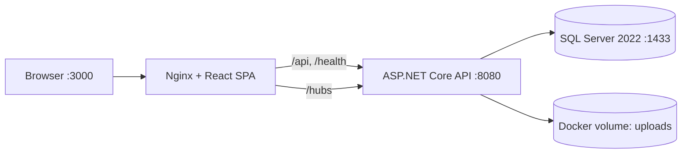

# InternLink - Architecture

**Verified:** 2026-09-08

## Runtime topology

Docker Compose defines three application services:

| Service | Image/build | Internal port | Host access |
|:--|:--|:--:|:--|
| `frontend` | `frontend/Dockerfile` | 80 | `localhost:3000` |
| `backend` | `backend/InternLink/Dockerfile` | 8080 | normally through Nginx; direct mapping is commented |
| `database` | `mcr.microsoft.com/mssql/server:2022-latest` | 1433 | normally Docker network only |

`backend` connects to `Server=database,1433`. The database is not the host SQL Server when using the current Compose file.

## Backend projects

- `InternLink.Domain`: entities and enums; no infrastructure dependencies.
- `InternLink.Application`: DTOs, interfaces, mappings and application contracts.
- `InternLink.Infrastructure`: EF Core context, migrations, services, repositories and persistence implementation.
- `InternLink.API`: controllers, middleware, health checks, Swagger, JWT and SignalR host.
- `InternLink.Shared`: shared response and utility types.
- `InternLink.Tests`: xUnit tests with in-memory EF and mocks.

At startup the API loads optional `appsettings.local.json`, configures Serilog, registers services, validates the JWT secret, maps controllers/health/SignalR, runs EF migrations and then runs seed initialization.

## Frontend

The SPA is built with React 19 and TypeScript. `AppRoutes.tsx` provides public authentication routes and protected admin, lecturer and student portals. Services under `frontend/src/services` call the backend through `apiClient.ts`; contexts provide authentication and semester state. Nginx serves the compiled SPA and proxies `/api/`, `/hubs/` and health requests.

## Security and cross-cutting behavior

- JWT bearer access tokens authenticate API requests.
- Refresh tokens support renewal and revocation.
- Authorization policies cover admin, super admin, lecturer, student and lecturer-or-admin access.
- SignalR notifications use `/hubs/notifications`; browser clients pass a bearer token through the `access_token` query value when required by WebSocket negotiation.
- Soft deletion is represented by `IsDeleted` on business entities.
- Health endpoints are `/health`, `/health/live` and `/health/ready`.
- Upload bytes are stored on the filesystem, not in SQL Server.

## Known boundaries

The current implementation does not provide a separate background worker or object-storage service. Email, cleanup, retention and backup operations are application/operations concerns and must not be documented as automatic jobs unless code is added.
