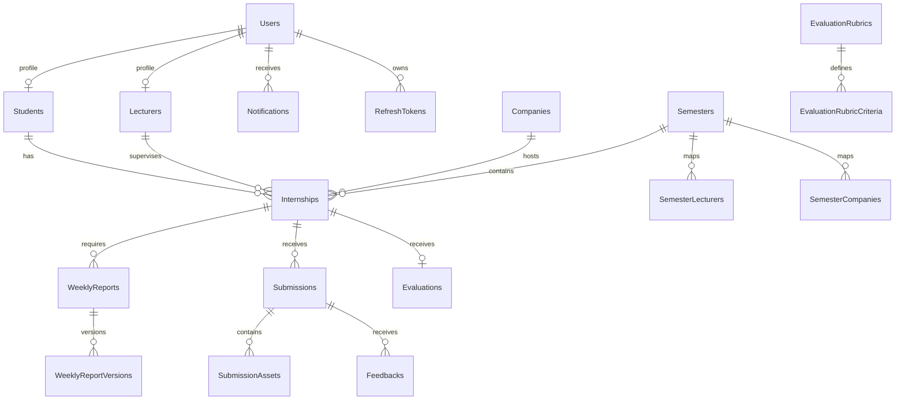

# InternLink - Domain Model

**Source:** `InternLink.Domain/Entities` and `AppDbContext`  
**Verified:** 2026-09-08

## Entities

The current EF model contains these DbSets/tables:

`Users`, `Students`, `Lecturers`, `Companies`, `Semesters`, `Internships`, `Submissions`, `SubmissionAssets`, `Feedbacks`, `Documents`, `Evaluations`, `WeeklyReports`, `WeeklyReportVersions`, `Notifications`, `PasswordResetTokens`, `RefreshTokens`, `EvaluationRubrics`, `EvaluationRubricCriteria`, `SystemSettings`, `AccountRequests`, `SemesterLecturers`, and `SemesterCompanies`.

`BaseEntity` supplies common identity/audit/soft-delete fields where inherited. User, student, lecturer and company records are separate domain profiles; a portal login is represented by `User` and may be linked to a profile.

## Core relationships

A student may have multiple internships over time, but the schema/service rules constrain one internship per student and semester. Internship lecturer, company and semester relationships can be nullable during setup or assignment.

## Main workflows

1. Admin manages semesters, people, companies and assignment mappings.
2. Students and lecturers use linked profiles under authenticated users.
3. An internship connects a student, supervising lecturer, company and semester.
4. Students create/upload weekly reports and final submissions.
5. Lecturers review reports, provide feedback, manage submission feedback and enter evaluations.
6. Evaluation rubrics and finalization support end-of-term grading and exports.
7. Notifications and refresh tokens support user communication and session control.

## Report lifecycle

Weekly reports support draft/update, file upload, submit, version history, lecturer review, lecturer feedback, student reply and feedback-read state. A new file can create a version without destroying the historical version metadata.

## Submission lifecycle

Submissions support text/external assets, uploaded files, bundles, resubmission, status updates, downloads, multiple assets, lecturer feedback and student replies. Physical files are stored outside SQL Server.

## Authorization model

- `SuperAdmin` manages global administration and may access cross-user operational data.
- `Lecturer` accesses assigned students/internships and lecturer workflow operations.
- `Student` accesses their own profile, internship, reports, submissions, feedback and evaluation.
- Services perform ownership/assignment checks in addition to controller authorization.
