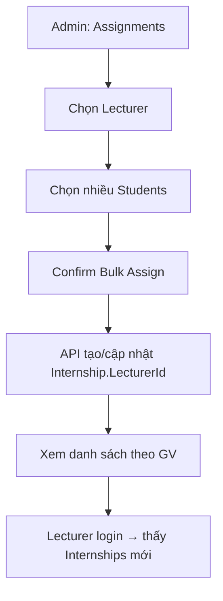

# Application Flow — Admin Bulk Assign

**IA:** SuperAdmin → Assignments  
**API sequence:** [`../sequence/bulk-assign.md`](../sequence/bulk-assign.md)

```mermaid
flowchart TD
  A[Admin: Assignments] --> B[Chọn Lecturer]
  B --> C[Chọn nhiều Students]
  C --> D[Confirm Bulk Assign]
  D --> E[API tạo/cập nhật Internship.LecturerId]
  E --> F[Xem danh sách theo GV]
  F --> G[Lecturer login → thấy Internships mới]
```
