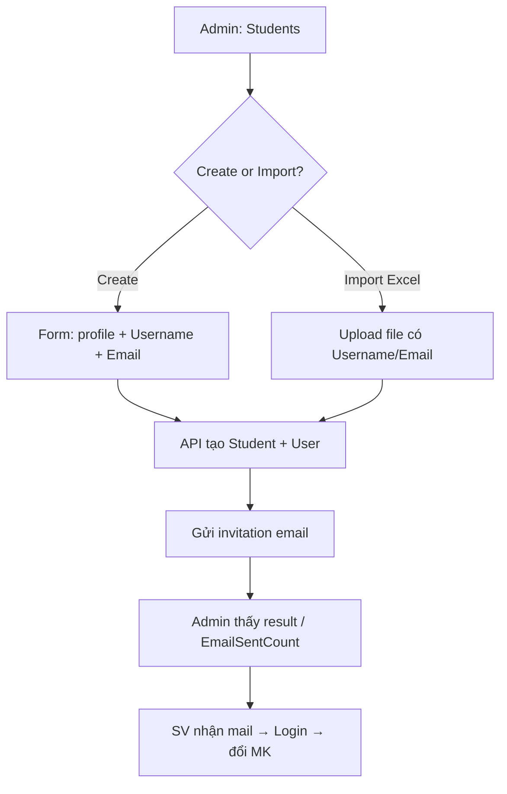

# Application Flow — Admin Import + Invitation

**IA:** SuperAdmin → Students  
**API sequence:** [`../sequence/invitation-email.md`](../sequence/invitation-email.md)

```mermaid
flowchart TD
  A[Admin: Students] --> B{Create or Import?}
  B -->|Create| C[Form: profile + Username + Email]
  B -->|Import Excel| D[Upload file có Username/Email]
  C --> E[API tạo Student + User]
  D --> E
  E --> F[Gửi invitation email]
  F --> G[Admin thấy result / EmailSentCount]
  G --> H[SV nhận mail → Login → đổi MK]
```
