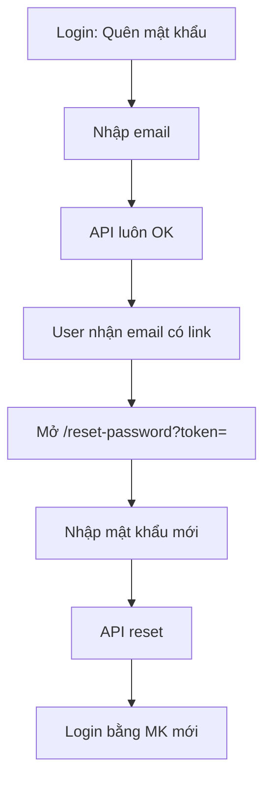

# Application Flow — Forgot / Reset Password

**IA:** Public  
**API sequence:** [`../sequence/forgot-password.md`](../sequence/forgot-password.md)

```mermaid
flowchart TD
  A[Login: Quên mật khẩu] --> B[Nhập email]
  B --> C[API luôn OK]
  C --> D[User nhận email có link]
  D --> E[Mở /reset-password?token=]
  E --> F[Nhập mật khẩu mới]
  F --> G[API reset]
  G --> H[Login bằng MK mới]
```
