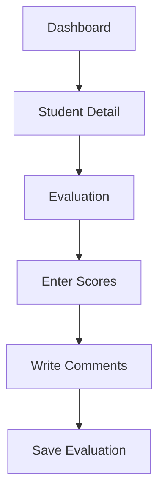

# Lecturer Evaluation Flow

```mermaid
flowchart TD

Dashboard["Dashboard"]

Student["Student Detail"]

Evaluation["Evaluation"]

Input["Enter Scores"]

Comment["Write Comments"]

Save["Save Evaluation"]

Dashboard --> Student

Student --> Evaluation

Evaluation --> Input

Input --> Comment

Comment --> Save
```