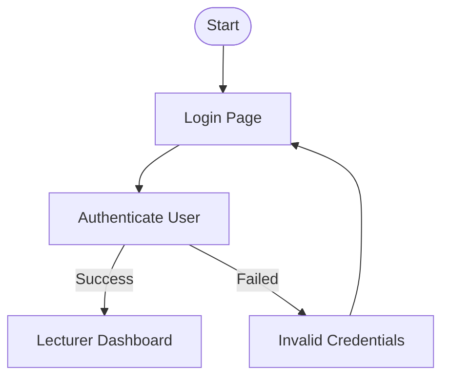

# Lecturer Login Flow

```mermaid
flowchart TD

Start([Start])

Login["Login Page"]

Authenticate["Authenticate User"]

Dashboard["Lecturer Dashboard"]

Error["Invalid Credentials"]

Start --> Login

Login --> Authenticate

Authenticate -->|Success| Dashboard

Authenticate -->|Failed| Error

Error --> Login
```