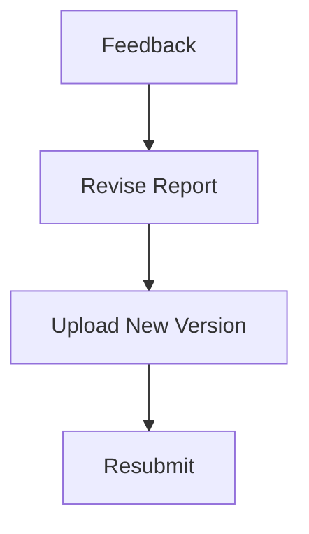

# Student Resubmission Flow

```mermaid
flowchart TD

Feedback["Feedback"]

Revise["Revise Report"]

Upload["Upload New Version"]

Submit["Resubmit"]

Feedback --> Revise

Revise --> Upload

Upload --> Submit
```