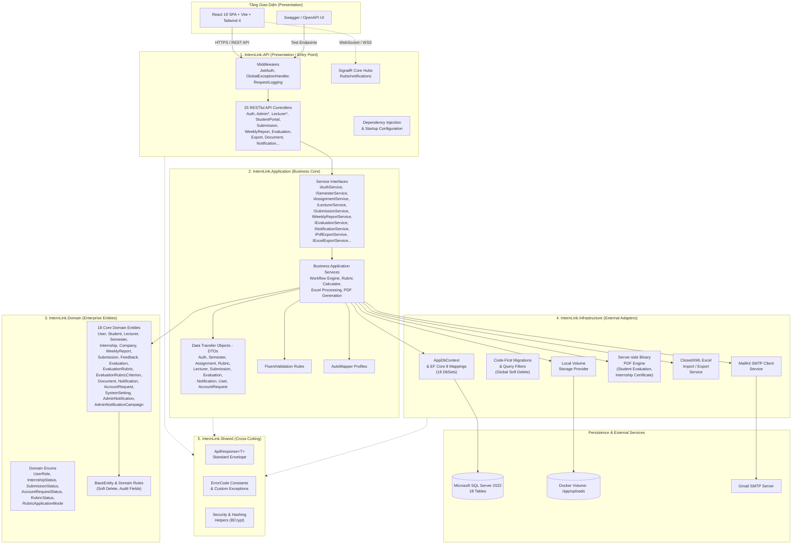

# Backend Clean Architecture — InternLink

**Dự án:** InternLink — Nền tảng Quản lý & Giám sát Thực tập  
**Kiến trúc:** Clean Architecture 5 Phân Tầng (.NET 8 Web API)  
**Phiên bản:** 4.0

---

---

## 📌 Nguyên Tắc Phụ Thuộc (Dependency Rule)

- **Domain**: Độc lập tuyệt đối — chứa 18 thực thể, enum và rule nghiệp vụ, không phụ thuộc thư viện ngoài.
- **Application**: Chỉ phụ thuộc Domain + Shared. Chứa toàn bộ Business Logic qua 15+ Service Interface.
- **Infrastructure**: Triển khai Adapter kỹ thuật — EF Core 8 (18 DbSet), Email, PDF, Excel, File Storage.
- **API**: Nhập DI Container, kích hoạt 25 Controllers phục vụ HTTP Request từ Frontend.

---

## 📌 Danh Sách 15 Service Interfaces

| Interface | Mô tả |
|:---|:---|
| `IAuthService` | Đăng nhập, JWT, Refresh Token, Forgot/Reset Password |
| `ISemesterService` | CRUD Học kỳ, Set Current, Close, Duplicate |
| `IAssignmentService` | Phân công GVHD, Auto-assign, Import/Export ma trận |
| `IAdminService` | Dashboard thống kê, CRUD Companies, Settings |
| `ILecturerService` | Dashboard, Students, Feedback, Notes, Bulk Notify |
| `ISubmissionService` | CRUD Submission, Feedback, Student Reply |
| `IWeeklyReportService` | CRUD Báo cáo tuần, Submit, Review |
| `IEvaluationService` | CRUD Đánh giá, Tính điểm, Finalize |
| `IRubricService` | CRUD Rubric, Submit, Approve, Reject |
| `INotificationService` | CRUD Thông báo, Mark Read |
| `IPdfExportService` | Xuất PDF: Bảng tổng hợp, Phiếu thực tập |
| `IExcelExportService` | Xuất Excel: Danh sách, Bảng điểm |
| `IAccountRequestService` | Duyệt/Từ chối yêu cầu tài khoản |
| `ISettingsService` | CRUD System Settings |
| `IStudentPortalService` | Profile sinh viên, Certificate PDF |
