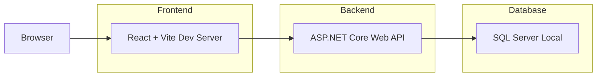
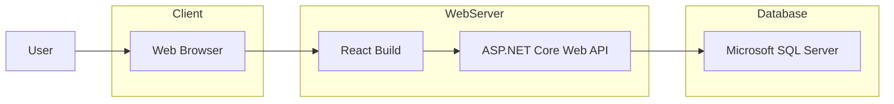

# Deployment Architecture

**Project:** InternLink – Internship Management & Collaboration Platform

**Version:** 1.0

**Status:** Draft

---

# 1. Overview

Deployment Architecture mô tả cách triển khai và vận hành hệ thống InternLink trong các môi trường khác nhau.

Phiên bản MVP được triển khai theo mô hình Client–Server với ba thành phần chính:

- Frontend
- Backend
- Database

Kiến trúc được thiết kế đơn giản để phục vụ quá trình phát triển, đồng thời dễ dàng mở rộng khi triển khai thực tế.

---

# 2. Development Environment

Trong quá trình phát triển, các thành phần được chạy độc lập trên máy lập trình viên.



## Components

| Component | Technology |
|------------|------------|
| Frontend | React + Vite |
| Backend | ASP.NET Core Web API |
| Database | SQL Server Express / Developer |

---

# 3. Production Environment

Khi triển khai thực tế, Frontend sẽ được build thành static files và Backend chạy như một dịch vụ Web API.



---

# 4. Deployment Components

## Frontend

- ReactJS
- Vite Build
- HTML
- CSS
- JavaScript

Triển khai dưới dạng static website.

---

## Backend

- ASP.NET Core Web API
- RESTful API
- JWT Authentication
- Entity Framework Core

Triển khai dưới dạng Web Application.

---

## Database

- Microsoft SQL Server

Lưu trữ toàn bộ dữ liệu của hệ thống.

---

# 5. Communication

Các thành phần giao tiếp như sau:

```text
Browser
      │
 HTTPS
      │
React Frontend
      │
 REST API
      │
ASP.NET Core Web API
      │
Entity Framework Core
      │
SQL Server
```

---

# 6. File Storage

Các tệp được tải lên (báo cáo, sản phẩm, biểu mẫu...) không lưu trực tiếp trong cơ sở dữ liệu.

Database chỉ lưu thông tin:

- FileName
- FileUrl
- FileType
- FileSize
- UploadedAt

Tệp được lưu trong thư mục lưu trữ của hệ thống.

---

# 7. Security

Các biện pháp bảo mật gồm:

- HTTPS
- JWT Authentication
- Role-based Authorization
- Password Hashing
- Input Validation

---

# 8. Future Deployment

Trong các phiên bản tiếp theo, hệ thống có thể mở rộng theo kiến trúc sau:

```mermaid
flowchart LR

User

↓

CloudFront

↓

React

↓

Load Balancer

↓

ASP.NET API

↓

SQL Server

↓

Cloud Storage
```

Có thể bổ sung:

- Docker
- Nginx
- Azure
- AWS
- Cloud Storage
- Redis Cache
- Email Service
- AI Service

---

# 9. Deployment Summary

InternLink MVP sử dụng mô hình triển khai Client–Server đơn giản, phù hợp với quy mô đồ án và dễ dàng mở rộng trong tương lai.

Kiến trúc này đảm bảo:

- Dễ triển khai.
- Dễ bảo trì.
- Dễ nâng cấp.
- Sẵn sàng tích hợp các dịch vụ mới khi cần.