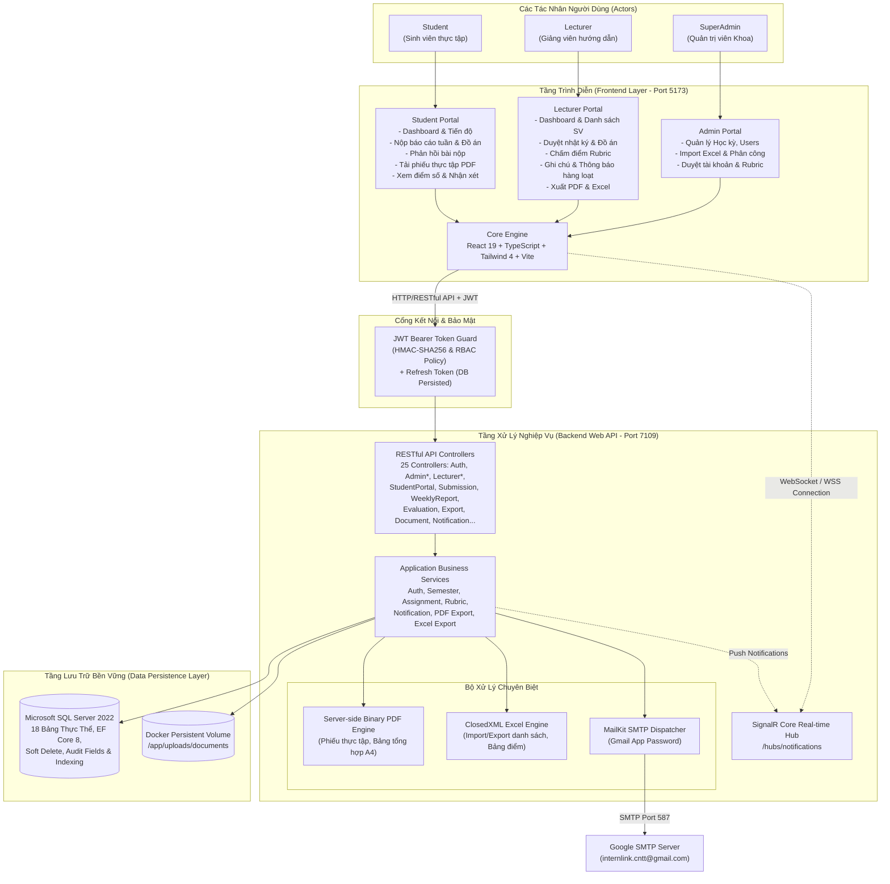

# Sơ Đồ Kiến Trúc Tổng Thể (Overall System Architecture)

**Dự án:** InternLink — Nền tảng Quản lý & Giám sát Thực tập Tốt nghiệp  
**Phiên bản:** 4.0  
**Kiến trúc:** Client-Server SPA & Web API Phân Tầng

---

---

## 📌 Đặc Điểm Nổi Bật Của Kiến Trúc

1. **Phân quyền 3 vai trò chặt chẽ (RBAC)**: SuperAdmin, Lecturer, Student — mỗi vai trò có bộ endpoint và giao diện riêng biệt, kiểm soát qua JWT Claims + Policy.
2. **Xử lý tài liệu Server-side**: PDF và Excel được tạo trực tiếp từ Backend (QuestPDF, ClosedXML), đảm bảo chuẩn mực và bảo mật dữ liệu.
3. **Hệ thống tài khoản linh hoạt**: Bao gồm luồng Account Requests (Admin duyệt cấp tài khoản) và Rubric Approval (Admin phê duyệt rubric giảng viên).
4. **Thao tác phản hồi 2 chiều**: Giảng viên ghi chú sinh viên (`/notes`), gửi thông báo hàng loạt scoped (`/notify`); Sinh viên phản hồi bài nộp (`/student-reply`).
5. **Chi phí vận hành tối ưu**: Docker Volume cục bộ, không phụ thuộc dịch vụ cloud bên ngoài.

---

## 📌 Bo Khoang Cong Nghe (Tech Stack Summary)

| Tầng | Công nghệ | Phiên bản |
|:---|:---|:---|
| Frontend | React, TypeScript, Tailwind CSS, Vite | 19, 5.x, 4.x, 6.x |
| Backend | ASP.NET Core Web API, Clean Architecture | 8.0 |
| ORM | Entity Framework Core | 8.0 |
| Database | Microsoft SQL Server | 2022 |
| Auth | JWT Bearer Token + Refresh Token | - |
| Real-time | SignalR Core | 8.0 |
| PDF | QuestPDF / iTextSharp | - |
| Excel | ClosedXML | - |
| Email | MailKit (SMTP Gmail) | - |
| Container | Docker + Docker Compose | - |
