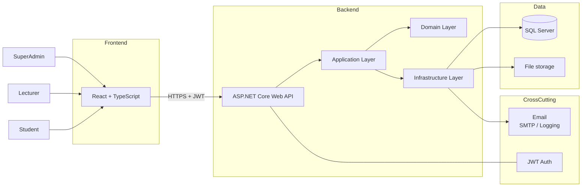

# Overall Architecture

**Version:** 2.0

```mermaid
flowchart LR
  SA[SuperAdmin]
  L[Lecturer]
  S[Student]

  SA --> FE
  L --> FE
  S --> FE

  subgraph Frontend
    FE[React + TypeScript]
  end

  subgraph Backend
    API[ASP.NET Core Web API]
    APP[Application Layer]
    DOMAIN[Domain Layer]
    INFRA[Infrastructure Layer]
  end

  subgraph CrossCutting
    JWT[JWT Auth]
    MAIL[Email<br/>SMTP / Logging]
  end

  subgraph Data
    DB[(SQL Server)]
    FS[File storage]
  end

  FE -->|HTTPS + JWT| API
  API --> APP
  APP --> DOMAIN
  APP --> INFRA
  API --- JWT
  INFRA --> DB
  INFRA --> FS
  INFRA --> MAIL
```
