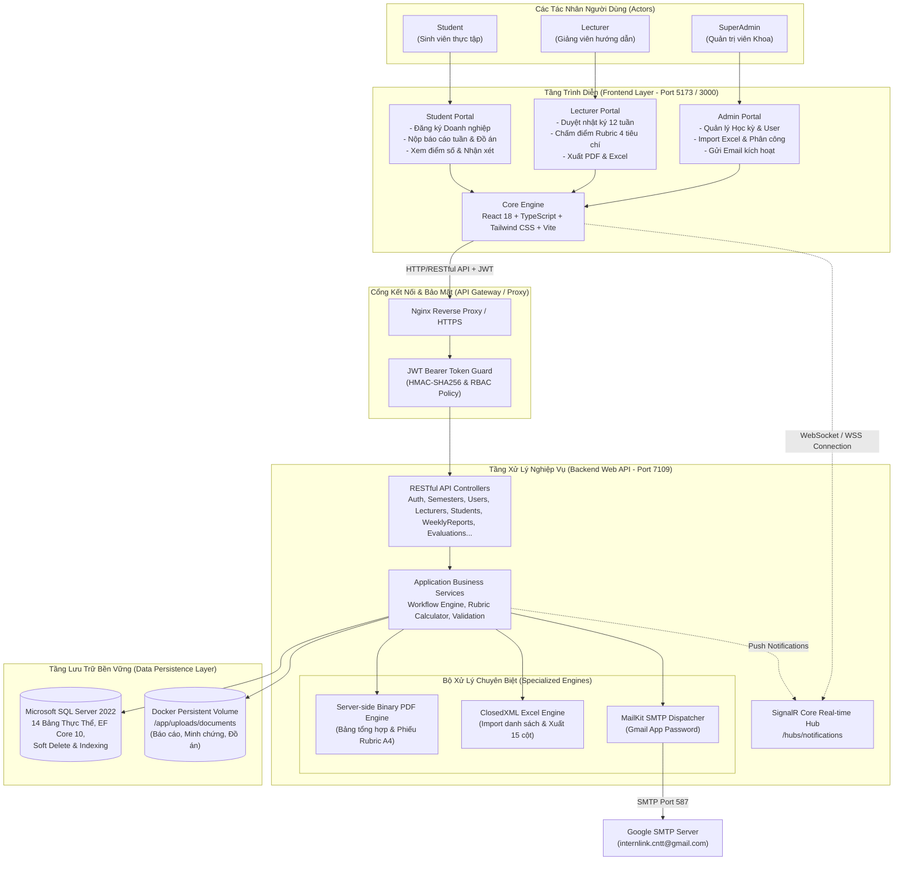

# Sơ Đồ Kiến Trúc Tổng Thể (Overall System Architecture)

**Dự án:** InternLink — Nền tảng Quản lý & Giám sát Thực tập Tốt nghiệp  
**Phiên bản:** 3.0  
**Kiến trúc:** Client-Server SPA & Web API Phân Tầng

---

---

## 📌 Đặc Điểm Nổi Bật Của Kiến Trúc

1. **Phân quyền độc lập 3 vai trò**: Tách biệt hoàn toàn luồng giao diện và quyền hạn API thông qua các Policy JWT chặt chẽ.
2. **Xử lý tài liệu và báo cáo Server-side**: Toàn bộ file Excel (.xlsx) và tài liệu PDF được tạo trực tiếp từ Backend, đảm bảo đúng định dạng chuẩn mực của Bộ GD&ĐT.
3. **Chi phí vận hành tối ưu (0đ Cloud)**: Hệ thống sử dụng Docker Volume gắn trên máy chủ/VPS cục bộ, không tốn chi phí thuê ngoài các dịch vụ S3 hay Firebase.
