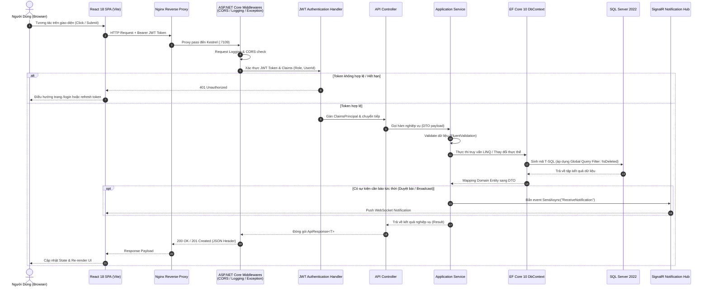

# Vòng Đời Xử Lý HTTP Request (Request Lifecycle) — InternLink

**Dự án:** InternLink — Nền tảng Quản lý & Giám sát Thực tập  
**Phiên bản:** 3.0

---

---

## 📌 Các Lớp Bảo Vệ & Xử Lý Ngoại Lệ (Cross-Cutting Concerns)

1. **Global Exception Handling Middleware**: Bắt mọi lỗi chưa được xử lý (`Unhandled Exception`), tự động ghi log và trả về mã phản hồi JSON đồng nhất (`success: false, error: { code, message }`) thay vì làm lộ StackTrace ra ngoài client.
2. **Global Query Filters**: Đảm bảo 100% truy vấn dữ liệu tự động loại bỏ các bản ghi đã xóa mềm (`IsDeleted = true`).
