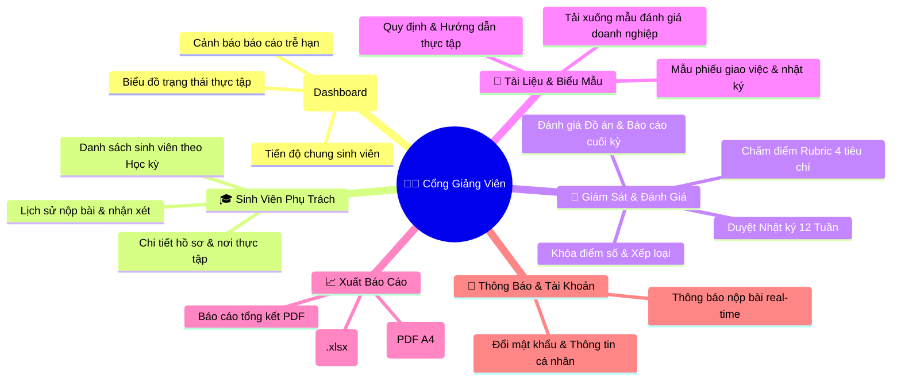

# Sơ Đồ Điều Hướng Giảng Viên (Lecturer Navigation) — InternLink

**Dự án:** InternLink — Cổng Thông Tin Giảng Viên Hướng Dẫn  
**Phiên bản:** 3.0

---

---

## 📌 Các Tính Năng Trọng Tâm

1. **Bộ lọc theo Học kỳ**: Giảng viên có thể chuyển đổi linh hoạt giữa các học kỳ hoặc tự động chọn học kỳ hiện tại (`IsCurrent = true`).
2. **Thao tác 1-Click**: Duyệt nhanh nhật ký tuần, mở tài liệu trực tiếp và xuất báo cáo PDF chuẩn mực ngay trên giao diện.
