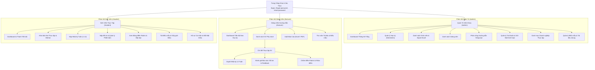

# Sơ Đồ Phân Cấp Màn Hình (Screen Hierarchy) — InternLink

**Dự án:** InternLink — Cấu trúc Giao diện Toàn Hệ thống  
**Phiên bản:** 3.0

---

```mermaid
flowchart TD
    AUTH["Trang Công Khai & Xác Thực<br/>/login, /forgot-password, /reset-password"]

    AUTH --> ADMIN_ROOT["Quản Trị Viên Khoa (/admin)"]
    AUTH --> LEC_ROOT["Giảng Viên Hướng Dẫn (/lecturer)"]
    AUTH --> STU_ROOT["Sinh Viên Thực Tập (/student)"]

    subgraph AdminScreens["Phân Hệ Quản Trị (/admin)"]
        ADMIN_ROOT --> ADM_DASH["Dashboard Thống Kê Tổng"]
        ADMIN_ROOT --> ADM_SEM["Quản lý Học kỳ (Semesters)"]
        ADMIN_ROOT --> ADM_STU["Danh sách Sinh viên & Import Excel"]
        ADMIN_ROOT --> ADM_LEC["Danh sách Giảng viên"]
        ADMIN_ROOT --> ADM_ASSIGN["Phân công Hướng dẫn Hàng loạt"]
        ADMIN_ROOT --> ADM_USER["Quản lý Tài khoản & Gửi Mail kích hoạt"]
        ADMIN_ROOT --> ADM_COMP["Danh mục Doanh nghiệp Thực tập"]
        ADMIN_ROOT --> ADM_DOC["Quản lý Biểu mẫu & Tài liệu chung"]
    end

    subgraph LecturerScreens["Phân Hệ Giảng Viên (/lecturer)"]
        LEC_ROOT --> LEC_DASH["Dashboard Tiến độ theo Học kỳ"]
        LEC_ROOT --> LEC_STU["Danh sách SV Phụ trách"]
        LEC_STU --> LEC_DETAIL["Chi tiết Thực tập SV"]
        LEC_DETAIL --> LEC_WEEK["Duyệt Nhật ký 12 Tuần"]
        LEC_DETAIL --> LEC_SUB["Đánh giá Báo cáo / Đồ án & Feedback"]
        LEC_DETAIL --> LEC_RUBRIC["Chấm điểm Rubric & Khóa điểm"]
        LEC_ROOT --> LEC_EXP["Xuất Báo Cáo (Excel / PDF)"]
        LEC_ROOT --> LEC_DOCS["Thư viện Tài liệu & Biểu mẫu"]
    end

    subgraph StudentScreens["Phân Hệ Sinh Viên (/student)"]
        STU_ROOT --> STU_DASH["Dashboard & Thanh Tiến độ"]
        STU_ROOT --> STU_COMP["Khai báo Nơi Thực tập & Mentor"]
        STU_ROOT --> STU_WEEK["Nộp Nhật ký Tuần (1-12)"]
        STU_ROOT --> STU_SUB["Nộp Đồ án & Quản lý Phiên bản"]
        STU_ROOT --> STU_EVAL["Xem Bảng điểm Rubric & Xếp loại"]
        STU_ROOT --> STU_DOCS["Tải Biểu mẫu & Giấy giới thiệu"]
        STU_ROOT --> STU_PROF["Hồ sơ Cá nhân & Đổi Mật khẩu"]
    end
```
