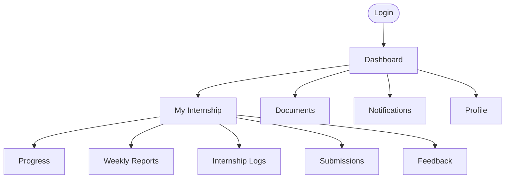

# Student Navigation

```mermaid
flowchart TD

Login([Login])

Dashboard["Dashboard"]

Internship["My Internship"]

Progress["Progress"]

WeeklyReports["Weekly Reports"]

InternshipLogs["Internship Logs"]

Submissions["Submissions"]

Feedback["Feedback"]

Documents["Documents"]

Notifications["Notifications"]

Profile["Profile"]

Login --> Dashboard

Dashboard --> Internship
Dashboard --> Documents
Dashboard --> Notifications
Dashboard --> Profile

Internship --> Progress
Internship --> WeeklyReports
Internship --> InternshipLogs
Internship --> Submissions
Internship --> Feedback
```