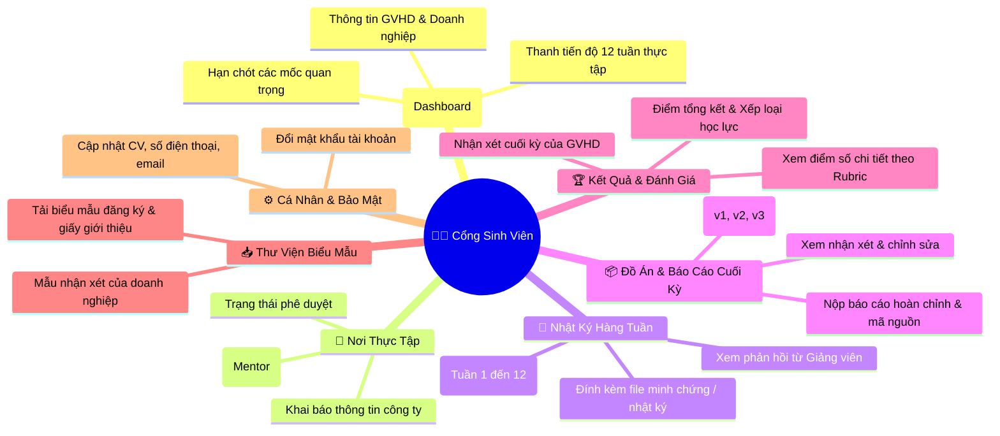

# Sơ Đồ Điều Hướng Sinh Viên (Student Navigation) — InternLink

**Dự án:** InternLink — Cổng Thông Tin Sinh Viên Thực Tập  
**Phiên bản:** 3.0

---

---

## 📌 Luồng Trải Nghiệm Sinh Viên

- **Đơn giản, trực quan**: Sinh viên nhìn thấy ngay nhiệm vụ cần hoàn thành trong tuần hiện tại trên Dashboard.
- **Minh bạch kết quả**: Bảng điểm Rubric 4 tiêu chí được hiển thị rõ ràng ngay sau khi Giảng viên hoàn tất chấm điểm.
