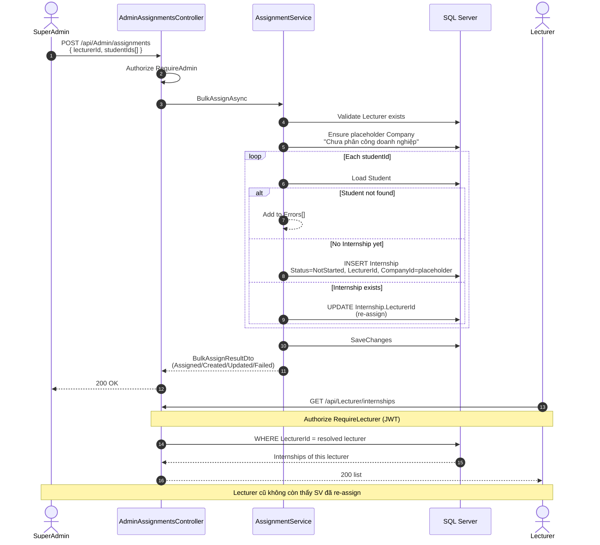

# Sequence — Bulk Assign Students → Lecturer

**Use case:** UC-A08  
**Actors:** SuperAdmin → API → AssignmentService → DB → Lecturer workflow

## Boundary

| Ai | Được làm |
|----|----------|
| SuperAdmin | Set / clear `LecturerId` |
| Lecturer | Set `CompanyId` only (`PUT /api/Internship/{id}/company`) |
| Lecturer gọi `/api/Admin/assignments` | **403 Forbidden** |
