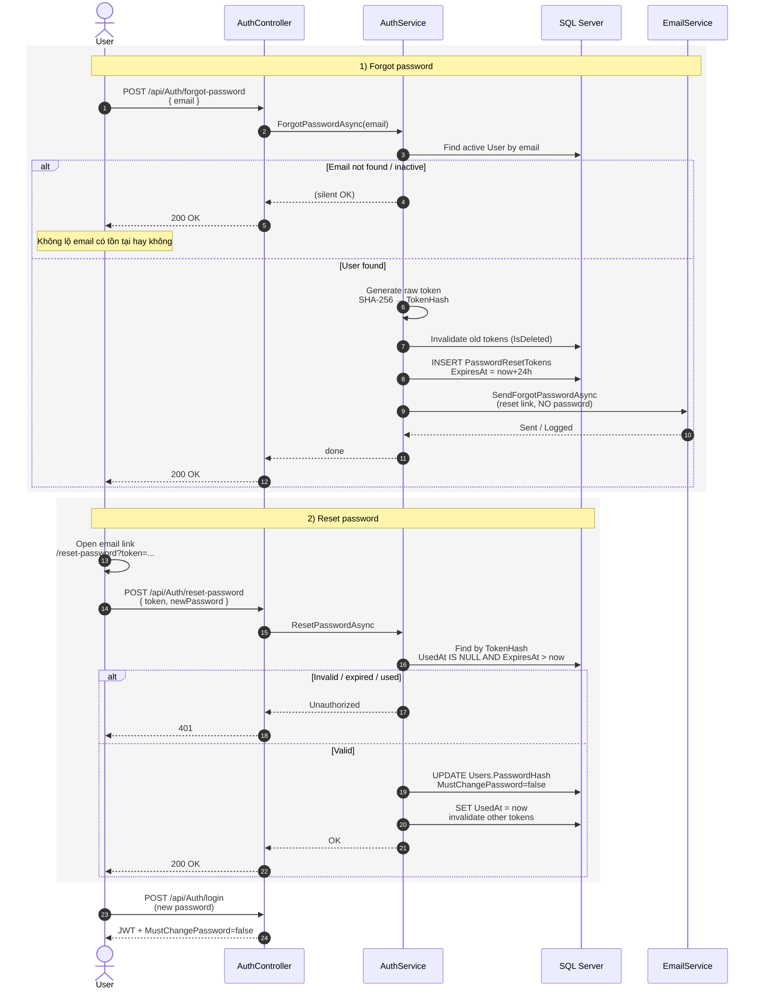

# Sequence — Forgot / Reset Password

**Use cases:** UC-03, UC-04  
**Actors:** User → Auth API → Email → User (reset)

## Security notes

- Token lưu **hash** trong DB, không lưu plaintext.
- One-time use (`UsedAt`) + expiry 24h.
- Khác UC-A07 (Admin reset): admin gửi **mật khẩu tạm** qua email; self-service chỉ gửi **link**.
