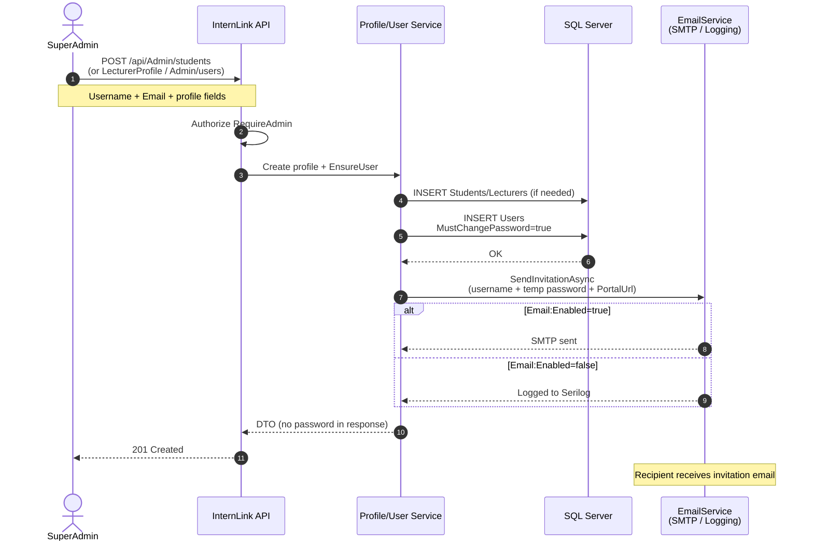

# Sequence — Invitation Email (create account)

**Use cases:** UC-A02 / UC-A04 / UC-A06  
**Actors:** SuperAdmin → API → DB → Email

## Kết quả

- User mới login bằng username + MK tạm.
- Client thấy `MustChangePassword=true` → bắt đổi MK (UC-02).
