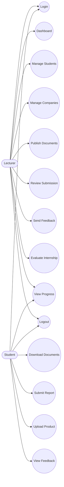

```mermaid
flowchart LR

Lecturer([Lecturer])
Student([Student])

UC1((Login))
UC2((Dashboard))
UC3((Manage Students))
UC4((Manage Companies))
UC5((Publish Documents))
UC6((Review Submission))
UC7((Send Feedback))
UC8((Evaluate Internship))

UC9((Download Documents))
UC10((Submit Report))
UC11((Upload Product))
UC12((View Feedback))
UC13((View Progress))
UC14((Logout))

Lecturer --> UC1
Lecturer --> UC2
Lecturer --> UC3
Lecturer --> UC4
Lecturer --> UC5
Lecturer --> UC6
Lecturer --> UC7
Lecturer --> UC8
Lecturer --> UC13
Lecturer --> UC14

Student --> UC1
Student --> UC9
Student --> UC10
Student --> UC11
Student --> UC12
Student --> UC13
Student --> UC14
```