```mermaid
flowchart TB
    subgraph Actors["Tác Nhân Hệ Thống"]
        SA(["👨‍💼 SuperAdmin<br/>(Quản trị viên Khoa)"])
        L(["👨‍🏫 Lecturer<br/>(Giảng viên hướng dẫn)"])
        S(["👨‍🎓 Student<br/>(Sinh viên thực tập)"])
    end

    subgraph AuthUC["Phân Hệ Xác Thực & Tài Khoản"]
        UC_LOGIN(["Đăng nhập hệ thống (JWT)"])
        UC_CHGPWD(["Đổi mật khẩu (Bắt buộc lần đầu)"])
        UC_FORGOT(["Quên & Đặt lại mật khẩu qua Email"])
        UC_PROFILE(["Xem & Cập nhật thông tin cá nhân"])
    end

    subgraph AdminUC["Phân Hệ Quản Trị Khoa (SuperAdmin Module)"]
        UC_ADM_SEM(["Quản lý Học kỳ (Kích hoạt IsCurrent)"])
        UC_ADM_IMP(["Import Sinh viên & GV từ Excel"])
        UC_ADM_ASSIGN(["Phân công GVHD cho Sinh viên"])
        UC_ADM_MAIL(["Gửi Email kích hoạt hàng loạt"])
        UC_ADM_USER(["Quản lý Người dùng & Khóa tài khoản"])
        UC_ADM_COMP(["Quản lý Danh mục Doanh nghiệp"])
        UC_ADM_BCAST(["Phát thông báo Broadcast (SignalR)"])
    end

    subgraph LecturerUC["Phân Hệ Giảng Viên (Lecturer Portal)"]
        UC_LEC_DASH(["Dashboard tiến độ SV phụ trách"])
        UC_LEC_REV_REP(["Duyệt Báo cáo Tuần (12 Tuần)"])
        UC_LEC_REV_SUB(["Đánh giá Đồ án / Báo cáo cuối kỳ"])
        UC_LEC_FEEDBACK(["Gửi Nhận xét & Phản hồi (Feedback)"])
        UC_LEC_EVAL(["Chấm điểm Rubric 4 tiêu chí & Chốt điểm"])
        UC_LEC_EXP_XLSX(["Xuất Bảng điểm Tổng hợp Excel (.xlsx)"])
        UC_LEC_EXP_PDF(["Xuất Báo cáo & Phiếu Rubric PDF"])
    end

    subgraph StudentUC["Phân Hệ Sinh Viên (Student Portal)"]
        UC_STU_COMP(["Đăng ký Nơi thực tập & Mentor"])
        UC_STU_REP(["Nộp Nhật ký tuần (1 - 12 tuần)"])
        UC_STU_SUB(["Nộp Báo cáo / Đồ án tốt nghiệp"])
        UC_STU_VIEW_EVAL(["Xem Kết quả Đánh giá & Xếp loại"])
        UC_STU_DOCS(["Tải Biểu mẫu & Hướng dẫn thực tập"])
    end

    %% SuperAdmin Connections
    SA --> UC_LOGIN
    SA --> UC_CHGPWD
    SA --> UC_ADM_SEM
    SA --> UC_ADM_IMP
    SA --> UC_ADM_ASSIGN
    SA --> UC_ADM_MAIL
    SA --> UC_ADM_USER
    SA --> UC_ADM_COMP
    SA --> UC_ADM_BCAST

    %% Lecturer Connections
    L --> UC_LOGIN
    L --> UC_CHGPWD
    L --> UC_PROFILE
    L --> UC_LEC_DASH
    L --> UC_LEC_REV_REP
    L --> UC_LEC_REV_SUB
    L --> UC_LEC_FEEDBACK
    L --> UC_LEC_EVAL
    L --> UC_LEC_EXP_XLSX
    L --> UC_LEC_EXP_PDF

    %% Student Connections
    S --> UC_LOGIN
    S --> UC_CHGPWD
    S --> UC_PROFILE
    S --> UC_STU_COMP
    S --> UC_STU_REP
    S --> UC_STU_SUB
    S --> UC_STU_VIEW_EVAL
    S --> UC_STU_DOCS

    %% Relationships (Include & Extend)
    UC_ADM_IMP -.->|&lt;&lt;include&gt;&gt;| UC_ADM_MAIL
    UC_LEC_REV_SUB -.->|&lt;&lt;include&gt;&gt;| UC_LEC_FEEDBACK
    UC_LEC_EXP_PDF -.->|&lt;&lt;extend&gt;&gt;| UC_LEC_EVAL
    UC_STU_SUB -.->|&lt;&lt;extend&gt;&gt;| UC_LEC_FEEDBACK
```

# Sơ Đồ Use Case Tổng Thể (Use Case Diagram) — InternLink

**Dự án:** InternLink — Nền tảng Quản lý và Giám sát Thực tập Tốt nghiệp  
**Phiên bản:** 3.0  
**Tác nhân (Actors):** SuperAdmin (Quản trị Khoa), Lecturer (GVHD), Student (Sinh viên)

---

---

## 📌 Phân Định Ranh Giới Quyền Hạn (Access Control Boundaries)

| Tác nhân | Quyền hạn chính | Giới hạn |
| :--- | :--- | :--- |
| **SuperAdmin** | Toàn quyền cấu hình học kỳ, import master data, phân công giảng viên - sinh viên, gửi email hàng loạt. | Không trực tiếp chấm điểm hay duyệt báo cáo tuần của sinh viên. |
| **Lecturer** | Toàn quyền trên nhóm sinh viên được phân công: duyệt nhật ký 12 tuần, chấm điểm Rubric, xuất báo cáo PDF/Excel. | Không thể can thiệp dữ liệu sinh viên của giảng viên khác hoặc sửa đổi học kỳ. |
| **Student** | Nộp bài, cập nhật tiến độ, tải biểu mẫu, tra cứu điểm và nhận xét của chính mình. | Chỉ xem được dữ liệu cá nhân, không truy cập được tài liệu của sinh viên khác. |
