```mermaid
flowchart TB
    subgraph Actors["Tác Nhân Hệ Thống"]
        SA(["👨‍💼 SuperAdmin<br/>(Quản trị viên Khoa)"])
        L(["👨‍🏫 Lecturer<br/>(Giảng viên hướng dẫn)"])
        S(["👨‍🎓 Student<br/>(Sinh viên thực tập)"])
    end

    subgraph AuthUC["Phân Hệ Xác Thực & Tài Khoản"]
        UC_LOGIN(["Đăng nhập JWT + Refresh Token"])
        UC_CHGPWD(["Đổi mật khẩu (Bắt buộc lần đầu)"])
        UC_FORGOT(["Quên & Đặt lại mật khẩu qua Email"])
        UC_PROFILE(["Xem & Cập nhật thông tin cá nhân"])
    end

    subgraph AdminUC["Phân Hệ Quản Trị Khoa (15 Use Cases)"]
        UC_ADM_DASH(["Dashboard thống kê tổng quan"])
        UC_ADM_SEM(["Quản lý Học kỳ (CRUD, Set Current, Close, Duplicate)"])
        UC_ADM_SEM_RUBRIC(["Phê duyệt Rubric của Giảng viên"])
        UC_ADM_IMP(["Import Sinh viên & GV từ Excel"])
        UC_ADM_ASSIGN(["Phân công GVHD (Manual, Auto, Bulk, Import/Export)"])
        UC_ADM_MAIL(["Gửi Email kích hoạt hàng loạt"])
        UC_ADM_USER(["Quản lý Users (CRUD, Reset Password, Lock/Unlock)"])
        UC_ADM_ACC_REQ(["Duyệt yêu cầu cấp tài khoản"])
        UC_ADM_COMP(["Quản lý Danh mục Doanh nghiệp"])
        UC_ADM_BCAST(["Phát thông báo Broadcast & Campaign"])
        UC_ADM_SETTING(["Cấu hình hệ thống (Faculty Settings)"])
        UC_ADM_EXPORT(["Xuất báo cáo tổng hợp Excel"])
    end

    subgraph LecturerUC["Phân Hệ Giảng Viên (12 Use Cases)"]
        UC_LEC_DASH(["Dashboard tiến độ SV phụ trách"])
        UC_LEC_STUDENTS(["Xem danh sách & Lưu ghi chú SV"])
        UC_LEC_NOTIFY(["Gửi thông báo hàng loạt (Scoped theo SV)"])
        UC_LEC_REV_REP(["Duyệt Báo cáo Tuần (12 Tuần)"])
        UC_LEC_REV_SUB(["Đánh giá Đồ án / Báo cáo cuối kỳ"])
        UC_LEC_FEEDBACK(["Gửi Nhận xét & Phản hồi (Feedback)"])
        UC_LEC_EVAL(["Chấm điểm Rubric & Chốt điểm"])
        UC_LEC_EXP_XLSX(["Xuất Bảng điểm Excel"])
        UC_LEC_EXP_PDF(["Xuất Báo cáo PDF"])
        UC_LEC_RUBRIC(["Xem rubric được áp dụng & Lưu bảng điểm"])
    end

    subgraph StudentUC["Phân Hệ Sinh Viên (10 Use Cases)"]
        UC_STU_DASH(["Dashboard tiến độ & Nhiệm vụ"])
        UC_STU_COMP(["Xem thông tin Doanh nghiệp thực tập"])
        UC_STU_REP(["Nộp Nhật ký tuần (1 - 12 tuần)"])
        UC_STU_SUB(["Nộp Đồ án / Báo cáo cuối kỳ"])
        UC_STU_REPLY(["Phản hồi bài nộp (Student Reply)"])
        UC_STU_VIEW_EVAL(["Xem Kết quả Đánh giá & Xếp loại"])
        UC_STU_CERT(["Tải phiếu thực tập PDF"])
        UC_STU_DOCS(["Tải Biểu mẫu & Hướng dẫn"])
        UC_STU_NOTIF(["Xem thông báo & Đánh dấu đã đọc"])
    end

    %% SuperAdmin Connections
    SA --> UC_LOGIN
    SA --> UC_CHGPWD
    SA --> UC_ADM_DASH
    SA --> UC_ADM_SEM
    SA --> UC_ADM_SEM_RUBRIC
    SA --> UC_ADM_IMP
    SA --> UC_ADM_ASSIGN
    SA --> UC_ADM_MAIL
    SA --> UC_ADM_USER
    SA --> UC_ADM_ACC_REQ
    SA --> UC_ADM_COMP
    SA --> UC_ADM_BCAST
    SA --> UC_ADM_SETTING
    SA --> UC_ADM_EXPORT

    %% Lecturer Connections
    L --> UC_LOGIN
    L --> UC_CHGPWD
    L --> UC_PROFILE
    L --> UC_LEC_DASH
    L --> UC_LEC_STUDENTS
    L --> UC_LEC_NOTIFY
    L --> UC_LEC_REV_REP
    L --> UC_LEC_REV_SUB
    L --> UC_LEC_FEEDBACK
    L --> UC_LEC_EVAL
    L --> UC_LEC_EXP_XLSX
    L --> UC_LEC_EXP_PDF
    L --> UC_LEC_RUBRIC

    %% Student Connections
    S --> UC_LOGIN
    S --> UC_CHGPWD
    S --> UC_PROFILE
    S --> UC_STU_DASH
    S --> UC_STU_COMP
    S --> UC_STU_REP
    S --> UC_STU_SUB
    S --> UC_STU_REPLY
    S --> UC_STU_VIEW_EVAL
    S --> UC_STU_CERT
    S --> UC_STU_DOCS
    S --> UC_STU_NOTIF

    %% Relationships
    UC_ADM_IMP -.->|<<include>>| UC_ADM_MAIL
    UC_LEC_REV_SUB -.->|<<include>>| UC_LEC_FEEDBACK
    UC_LEC_EXP_PDF -.->|<<extend>>| UC_LEC_EVAL
    UC_STU_SUB -.->|<<extend>>| UC_STU_REPLY
    UC_ADM_SEM_RUBRIC -.->|<<include>>| UC_ADM_SEM
    UC_LEC_NOTIFY -.->|<<include>>| UC_LEC_STUDENTS
```

# Sơ Đồ Use Case Tổng Thể (Use Case Diagram) — InternLink

**Dự án:** InternLink — Nền tảng Quản lý và Giám sát Thực tập Tốt nghiệp  
**Phiên bản:** 4.0  
**Tác nhân (Actors):** SuperAdmin (Quản trị Khoa), Lecturer (GVHD), Student (Sinh viên)

---

---

## 📌 Tổng Hợp Use Case Theo Tác Nhân

| Tác nhân | Số Use Cases | Mô tả chính |
|:---|:---:|:---|
| **SuperAdmin** | 15 | Quản lý toàn bộ hệ thống: Users, Semesters, Assignments, Account Requests, Rubric Approval, Notifications, Settings, Export |
| **Lecturer** | 12 | Quản lý nhóm SV: Dashboard, Notes, Bulk Notify, Review Reports/Submissions, Grade Rubric, Export PDF/Excel |
| **Student** | 10 | Tự quản lý tiến độ: Dashboard, Reports, Submissions, Student Reply, PDF Certificate, View Evaluations |
| **Tổng cộng** | **37** | - |

---

## 📌 Phân Định Ranh Giới Quyền Hạn (Access Control Boundaries)

| Tác nhân | Quyền hạn chính | Giới hạn |
|:---|:---|:---|
| **SuperAdmin** | Toàn quyền cấu hình, import, phân công, duyệt tài khoản, phê duyệt rubric, broadcast thông báo. | Không chấm điểm hay duyệt báo cáo tuần SV. |
| **Lecturer** | Toàn quyền trên nhóm SV được phân công: ghi chú, thông báo scoped, duyệt nhật ký, chấm rubric, xuất báo cáo. | Không can thiệp SV giảng viên khác, không sửa học kỳ. |
| **Student** | Nộp bài, phản hồi bài nộp, tải PDF chứng nhận, xem điểm cá nhân. | Chỉ xem dữ liệu cá nhân, không truy cập tài liệu SV khác. |
