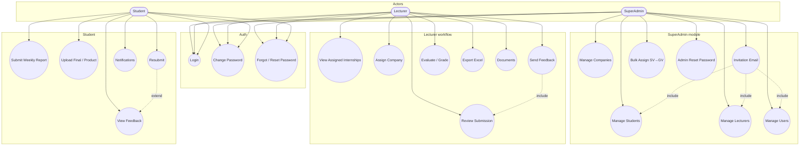

# Use Case Diagram — InternLink

**Version:** 2.0 — SuperAdmin + Lecturer + Student

## Notes

- SuperAdmin **không** dùng `RequireLecturer` endpoints để duyệt/chấm.
- Lecturer **không** gọi `/api/Admin/*` (403).
- Phân công GV (`LecturerId`) = SuperAdmin; gán DN (`CompanyId`) = Lecturer.
