```mermaid
flowchart TB
    %% ==========================================
    %% ACTORS
    %% ==========================================
    subgraph Actors["👥 Tác Nhân Hệ Thống"]
        SA(["👨‍💼 SuperAdmin<br/>(Quản trị viên Khoa)"])
        L(["👨‍🏫 Lecturer<br/>(Giảng viên hướng dẫn)"])
        S(["👨‍🎓 Student<br/>(Sinh viên thực tập)"])
    end

    %% ==========================================
    %% COMMON AUTH USE CASES
    %% ==========================================
    subgraph AuthUC["🔐 Phân Hệ Xác Thực Chung"]
        UC_AUTH_LOGIN(["Đăng nhập hệ thống<br/>(JWT + Refresh Token)"])
        UC_AUTH_FORGOT(["Quên & Đặt lại mật khẩu<br/>(Email verification link)"])
    end

    %% ==========================================
    %% SUPERADMIN USE CASES (15 UCs)
    %% ==========================================
    subgraph AdminUC["🏛️ Phân Hệ Quản Trị Khoa (15 Use Cases — UC-ADM)"]
        UC_ADM_01(["UC-ADM-01: Quản lý Học kỳ<br/>(CRUD, Set Current, Close, Duplicate)"])
        UC_ADM_02(["UC-ADM-02: Quản lý Users<br/>(CRUD, Reset Password, Lock/Unlock)"])
        UC_ADM_03(["UC-ADM-03: Import Sinh viên<br/>(Excel template, validate & parse)"])
        UC_ADM_04(["UC-ADM-04: Import Giảng viên<br/>(Excel template, phân khoa)"])
        UC_ADM_05(["UC-ADM-05: Import Doanh nghiệp<br/>(Excel danh mục đối tác)"])
        UC_ADM_06(["UC-ADM-06: Phân công Hướng dẫn<br/>(Bulk/Auto assign, Company allocation)"])
        UC_ADM_07(["UC-ADM-07: Quản lý Yêu cầu TK<br/>(Duyệt/Từ chối/Cấp phát tài khoản)"])
        UC_ADM_08(["UC-ADM-08: Tạo Rubric Đánh giá<br/>(Tiêu chí, trọng số, max điểm)"])
        UC_ADM_09(["UC-ADM-09: Phê duyệt Rubric<br/>(Approve/Reject rubric cấp khoa)"])
        UC_ADM_10(["UC-ADM-10: Phát Thông báo Broadcast<br/>(Toàn trường, GV hoặc SV)"])
        UC_ADM_11(["UC-ADM-11: Cấu hình Hệ thống<br/>(Faculty Settings, hạn nộp, rules)"])
        UC_ADM_12(["UC-ADM-12: Dashboard Tổng quan<br/>(Thống kê KPI, biểu đồ tiến độ)"])
        UC_ADM_13(["UC-ADM-13: Xuất Danh sách Excel<br/>(Export SV, GV, Doanh nghiệp)"])
        UC_ADM_14(["UC-ADM-14: Xuất Ma trận Phân công<br/>(Export bảng gán GVHD - SV)"])
        UC_ADM_15(["UC-ADM-15: Kiểm thử Email SMTP<br/>(Gửi test mail xác minh dịch vụ)"])
    end

    %% ==========================================
    %% LECTURER USE CASES (12 UCs)
    %% ==========================================
    subgraph LecturerUC["🎓 Phân Hệ Giảng Viên (12 Use Cases — UC-LEC)"]
        UC_LEC_01(["UC-LEC-01: Dashboard Tiến độ<br/>(KPI SV phụ trách, Action items, Trends)"])
        UC_LEC_02(["UC-LEC-02: Xem Danh sách SV<br/>(Tìm kiếm, bộ lọc trạng thái, chi tiết SV)"])
        UC_LEC_03(["UC-LEC-03: Lưu Ghi chú Sinh viên<br/>(Private Notes theo dõi quá trình)"])
        UC_LEC_04(["UC-LEC-04: Gửi Thông báo Scoped<br/>(Bulk notify nhóm SV phụ trách)"])
        UC_LEC_05(["UC-LEC-05: Duyệt Báo cáo tuần<br/>(16 tuần: Duyệt/Yêu cầu sửa/Nhận xét)"])
        UC_LEC_06(["UC-LEC-06: Review Đồ án / Bài nộp<br/>(Phản hồi bài nộp, file đính kèm)"])
        UC_LEC_07(["UC-LEC-07: Chấm điểm Rubric<br/>(Dynamic criteria, chấm điểm chi tiết)"])
        UC_LEC_08(["UC-LEC-08: Khóa điểm & Chốt kết quả<br/>(Finalize evaluation, tính điểm chữ)"])
        UC_LEC_09(["UC-LEC-09: Xuất Bảng điểm Excel<br/>(Tổng hợp điểm thành phần & cuối kỳ)"])
        UC_LEC_10(["UC-LEC-10: Xuất Báo cáo & Đánh giá PDF<br/>(Phiếu đánh giá thực tập chính thức)"])
        UC_LEC_11(["UC-LEC-11: Quản lý Kho Tài liệu<br/>(Upload, chia sẻ tài liệu hướng dẫn)"])
        UC_LEC_12(["UC-LEC-12: Phản hồi Phản biện SV<br/>(Trao đổi hai chiều qua bài nộp)"])
    end

    %% ==========================================
    %% STUDENT USE CASES (10 UCs)
    %% ==========================================
    subgraph StudentUC["🎒 Phân Hệ Sinh Viên (10 Use Cases — UC-STU)"]
        UC_STU_01(["UC-STU-01: Dashboard Tiến độ & KPI<br/>(Tasks, hạn nộp, feedback mới nhất)"])
        UC_STU_02(["UC-STU-02: Xem Kỳ thực tập & Kế hoạch<br/>(Timeline, kế hoạch tuần, GVHD & DN)"])
        UC_STU_03(["UC-STU-03: Nộp Nhật ký Báo cáo tuần<br/>(16 tuần: viết tóm tắt, đính kèm file)"])
        UC_STU_04(["UC-STU-04: Nộp Báo cáo / Đồ án Cuối kỳ<br/>(Upload file báo cáo, resubmit nếu cần)"])
        UC_STU_05(["UC-STU-05: Phản hồi Feedback SV Reply<br/>(Trao đổi trực tiếp với GVHD trên bài nộp)"])
        UC_STU_06(["UC-STU-06: Tải Phiếu Chứng nhận PDF<br/>(Giấy xác nhận kết quả thực tập)"])
        UC_STU_07(["UC-STU-07: Xem Điểm & Xếp loại<br/>(Chi tiết điểm rubric & điểm tổng kết)"])
        UC_STU_08(["UC-STU-08: Tải Biểu mẫu & Hướng dẫn<br/>(Kho tài nguyên mẫu từ Khoa/GVHD)"])
        UC_STU_09(["UC-STU-09: Quản lý Thông báo<br/>(Nhận thông báo real-time & đánh dấu đã đọc)"])
        UC_STU_10(["UC-STU-10: Đổi mật khẩu cá nhân<br/>(Đổi mật khẩu định kỳ / bắt buộc)"])
    end

    %% ==========================================
    %% ACTOR TO USE CASE ASSOCIATIONS
    %% ==========================================
    %% SuperAdmin Associations
    SA --> UC_AUTH_LOGIN
    SA --> UC_AUTH_FORGOT
    SA --> UC_ADM_01
    SA --> UC_ADM_02
    SA --> UC_ADM_03
    SA --> UC_ADM_04
    SA --> UC_ADM_05
    SA --> UC_ADM_06
    SA --> UC_ADM_07
    SA --> UC_ADM_08
    SA --> UC_ADM_09
    SA --> UC_ADM_10
    SA --> UC_ADM_11
    SA --> UC_ADM_12
    SA --> UC_ADM_13
    SA --> UC_ADM_14
    SA --> UC_ADM_15

    %% Lecturer Associations
    L --> UC_AUTH_LOGIN
    L --> UC_AUTH_FORGOT
    L --> UC_LEC_01
    L --> UC_LEC_02
    L --> UC_LEC_03
    L --> UC_LEC_04
    L --> UC_LEC_05
    L --> UC_LEC_06
    L --> UC_LEC_07
    L --> UC_LEC_08
    L --> UC_LEC_09
    L --> UC_LEC_10
    L --> UC_LEC_11
    L --> UC_LEC_12

    %% Student Associations
    S --> UC_AUTH_LOGIN
    S --> UC_AUTH_FORGOT
    S --> UC_STU_01
    S --> UC_STU_02
    S --> UC_STU_03
    S --> UC_STU_04
    S --> UC_STU_05
    S --> UC_STU_06
    S --> UC_STU_07
    S --> UC_STU_08
    S --> UC_STU_09
    S --> UC_STU_10

    %% ==========================================
    %% RELATIONSHIPS (INCLUDE & EXTEND)
    %% ==========================================
    UC_ADM_03 -. "«extend»" .-> UC_ADM_02
    UC_ADM_04 -. "«extend»" .-> UC_ADM_02
    UC_ADM_06 -. "«include»" .-> UC_ADM_01
    UC_ADM_09 -. "«extend»" .-> UC_ADM_08
    UC_ADM_14 -. "«extend»" .-> UC_ADM_06

    UC_LEC_03 -. "«include»" .-> UC_LEC_02
    UC_LEC_04 -. "«include»" .-> UC_LEC_02
    UC_LEC_08 -. "«include»" .-> UC_LEC_07
    UC_LEC_10 -. "«extend»" .-> UC_LEC_08

    UC_STU_05 -. "«extend»" .-> UC_STU_04
    UC_STU_06 -. "«extend»" .-> UC_STU_07
```

# Sơ Đồ Use Case Tổng Thể (Use Case Diagram) — InternLink

**Dự án:** InternLink — Nền tảng Quản lý và Giám sát Thực tập Tốt nghiệp  
**Phiên bản:** 4.0  
**Tác nhân (Actors):** SuperAdmin (Quản trị Khoa), Lecturer (GVHD), Student (Sinh viên)  
**Tài liệu tham chiếu chuẩn:** [`04-Use-Case-Specification.md`](../../04-Use-Case-Specification.md)

---

---

## 📌 Bảng Đối Chiếu 37 Use Cases Chuẩn Hóa

### 1. Phân Hệ SuperAdmin (15 Use Cases)

| Mã UC | Tên Use Case | Mô tả Nghiệp vụ | API Endpoint Liên quan |
|:---|:---|:---|:---|
| **UC-ADM-01** | Quản lý Học kỳ | CRUD học kỳ, thiết lập kỳ hiện tại, đóng kỳ, sao chép cấu hình sang kỳ mới | `/api/AdminSemesters`, `/api/Semesters` |
| **UC-ADM-02** | Quản lý Users | Xem danh sách người dùng, phân quyền, khóa/mở tài khoản, reset mật khẩu | `/api/Users` |
| **UC-ADM-03** | Import Sinh viên | Import danh sách sinh viên từ file Excel, validate trùng MSSV/Email | `/api/Admin/import/students` |
| **UC-ADM-04** | Import Giảng viên | Import danh sách GVHD từ file Excel, phân bổ bộ môn/khoa | `/api/Admin/import/lecturers` |
| **UC-ADM-05** | Import Doanh nghiệp | Import danh bạ đối tác tiếp nhận thực tập | `/api/Admin/import/companies` |
| **UC-ADM-06** | Phân công Hướng dẫn | Phân công GVHD cho SV (Manual, Auto-balance, Bulk, Company-based) | `/api/Assignment` |
| **UC-ADM-07** | Quản lý Yêu cầu TK | Xét duyệt, từ chối hoặc cấp phát tài khoản khi có yêu cầu đăng ký mới | `/api/AccountRequest` |
| **UC-ADM-08** | Tạo Rubric Đánh giá | Soạn thảo tiêu chí chấm điểm, thiết lập tỷ trọng & điểm tối đa | `/api/Rubric` |
| **UC-ADM-09** | Phê duyệt Rubric | Duyệt (Approve) hoặc yêu cầu chỉnh sửa (Reject) rubric cấp khoa | `/api/Rubric/{id}/approve` |
| **UC-ADM-10** | Phát Thông báo | Gửi thông báo Broadcast đến toàn bộ hệ thống hoặc theo nhóm đối tượng | `/api/Notification/broadcast` |
| **UC-ADM-11** | Cấu hình Hệ thống | Cấu hình tham số học khoa: hạn nộp, module kích hoạt, quota tối đa | `/api/Settings` |
| **UC-ADM-12** | Dashboard Tổng quan | Thống kê số lượng SV/GV, tỷ lệ hoàn thành báo cáo, biểu đồ tiến độ khoa | `/api/Dashboard` |
| **UC-ADM-13** | Xuất Danh sách Excel | Xuất dữ liệu sinh viên, giảng viên, doanh nghiệp ra file Excel | `/api/Admin/export` |
| **UC-ADM-14** | Xuất Ma trận Phân công | Xuất bảng phân công GVHD - SV ra file Excel phục vụ lưu trữ | `/api/Assignment/export` |
| **UC-ADM-15** | Kiểm thử Email SMTP | Gửi thư thử nghiệm kiểm tra tính sẵn sàng của dịch vụ SMTP | `/api/Email/test` |

---

### 2. Phân Hệ Lecturer (12 Use Cases)

| Mã UC | Tên Use Case | Mô tả Nghiệp vụ | API Endpoint Liên quan |
|:---|:---|:---|:---|
| **UC-LEC-01** | Dashboard Tiến độ | Thống kê số SV hướng dẫn, số báo cáo chờ duyệt, danh sách cảnh báo trễ hạn | `/api/Lecturer/dashboard` |
| **UC-LEC-02** | Xem Danh sách SV | Tìm kiếm, lọc danh sách SV được phân công theo trạng thái thực tập & công ty | `/api/Lecturer/students` |
| **UC-LEC-03** | Lưu Ghi chú Sinh viên | Lưu ghi chú cá nhân (private notes) để theo dõi thái độ và tiến độ của từng SV | `/api/Lecturer/students/{id}/notes` |
| **UC-LEC-04** | Bulk Notify SV | Gửi thông báo nhanh đồng thời cho nhóm SV đang hướng dẫn | `/api/Lecturer/students/notify` |
| **UC-LEC-05** | Duyệt Báo cáo tuần | Duyệt/Trả về yêu cầu viết lại báo cáo tuần (chu trình 16 tuần), kèm lời nhận xét | `/api/Lecturer/weekly-reports` |
| **UC-LEC-06** | Review Đồ án / Bài nộp | Đọc, tải file đính kèm và gửi nhận xét cho các cột mốc nộp bài (Giữa kỳ/Cuối kỳ) | `/api/Lecturer/submissions` |
| **UC-LEC-07** | Chấm điểm Rubric | Nhập điểm theo từng tiêu chí động thuộc rubric đã được khoa phê duyệt | `/api/Lecturer/evaluate` |
| **UC-LEC-08** | Khóa điểm & Chốt kết quả | Khóa điểm đánh giá cuối cùng, tính điểm trung bình và xếp loại học phần | `/api/Lecturer/finalize-grade` |
| **UC-LEC-09** | Xuất Bảng điểm Excel | Xuất bảng tổng hợp kết quả đánh giá thực tập của nhóm SV ra file Excel | `/api/Lecturer/export/grades-excel` |
| **UC-LEC-10** | Xuất Báo cáo & PDF | Xuất biên bản chấm điểm và phiếu nhận xét đánh giá thực tập ra file PDF | `/api/Lecturer/export/evaluation-pdf` |
| **UC-LEC-11** | Quản lý Kho Tài liệu | Tải lên và quản lý tài liệu, biểu mẫu, hướng dẫn chuyên đề cho SV tải về | `/api/Lecturer/documents` |
| **UC-LEC-12** | Phản hồi Phản biện SV | Trao đổi hai chiều và giải đáp thắc mắc của SV trên từng bài nộp | `/api/Submission/{id}/feedback` |

---

### 3. Phân Hệ Student (10 Use Cases)

| Mã UC | Tên Use Case | Mô tả Nghiệp vụ | API Endpoint Liên quan |
|:---|:---|:---|:---|
| **UC-STU-01** | Dashboard Tiến độ & KPI | Theo dõi số tuần đã nộp, hạn nộp sắp tới, thông báo mới và phản hồi từ GVHD | `/api/StudentPortal/dashboard` |
| **UC-STU-02** | Xem Kỳ thực tập & Kế hoạch | Xem thông tin học kỳ, timeline 16 tuần, thông tin liên hệ GVHD và doanh nghiệp | `/api/StudentPortal/internship-info` |
| **UC-STU-03** | Nộp Nhật ký Báo cáo tuần | Tạo mới, cập nhật và nộp nhật ký công việc theo từng tuần (từ tuần 1 đến tuần 16) | `/api/StudentPortal/weekly-reports` |
| **UC-STU-04** | Nộp Báo cáo / Đồ án Cuối kỳ | Tải lên file đồ án/báo cáo thực tập theo đúng định dạng và deadline | `/api/Submission/submit` |
| **UC-STU-05** | Phản hồi Feedback (SV Reply) | Trả lời trực tiếp phản hồi của giảng viên hướng dẫn trên từng bài nộp | `/api/Submission/{id}/student-reply` |
| **UC-STU-06** | Tải Phiếu Chứng nhận PDF | Tải file PDF Giấy chứng nhận hoàn thành thực tập / Phiếu đánh giá chính thức | `/api/StudentPortal/internship-certificate` |
| **UC-STU-07** | Xem Điểm & Xếp loại | Xem chi tiết điểm theo rubric tiêu chí, điểm tổng kết và xếp loại đạt/không đạt | `/api/StudentPortal/grades` |
| **UC-STU-08** | Tải Biểu mẫu & Hướng dẫn | Tải các tài liệu mẫu (CV, hợp đồng thực tập, mẫu báo cáo) từ thư viện khoa | `/api/StudentPortal/documents` |
| **UC-STU-09** | Quản lý Thông báo | Xem danh sách thông báo từ Khoa/GVHD, đánh dấu đã đọc hoặc nhận qua SignalR | `/api/Notification` |
| **UC-STU-10** | Đổi mật khẩu cá nhân | Đổi mật khẩu đăng nhập cá nhân (bắt buộc khi đăng nhập lần đầu với tài khoản cấp) | `/api/Auth/change-password` |

---

## 📌 Phân Định Ranh Giới Quyền Hạn (RBAC Security Boundaries)

| Tác nhân (Role) | Phạm vi & Quyền hạn | Ranh giới Bảo mật (Boundary Constraints) |
|:---|:---|:---|
| **SuperAdmin** | Toàn quyền cấu hình hệ thống: Quản lý học kỳ, phân công GVHD, duyệt tài khoản, duyệt rubric, cấu hình khoa, broadcast thông báo. | ❌ Không trực tiếp chấm điểm SV hay duyệt báo cáo tuần (tôn trọng tính độc lập học thuật của GVHD). |
| **Lecturer** | Toàn quyền quản lý chuyên môn trên **nhóm SV được phân công**: xem tiến độ, duyệt báo cáo tuần, phản hồi đồ án, chấm rubric, khóa điểm, xuất PDF/Excel. | ❌ Không được can thiệp vào sinh viên của GVHD khác (bảo vệ bằng JWT Claims & LecturerId Scope). Không được sửa cấu hình hệ thống/học kỳ. |
| **Student** | Tự quản lý tiến độ cá nhân: Nộp báo cáo tuần, nộp đồ án, phản hồi góp ý của GV, tra cứu điểm và tải giấy xác nhận PDF. | ❌ Chỉ truy cập được dữ liệu của chính mình (StudentId Scope). Không được xem bài nộp, điểm số hay ghi chú riêng tư của sinh viên khác. |
