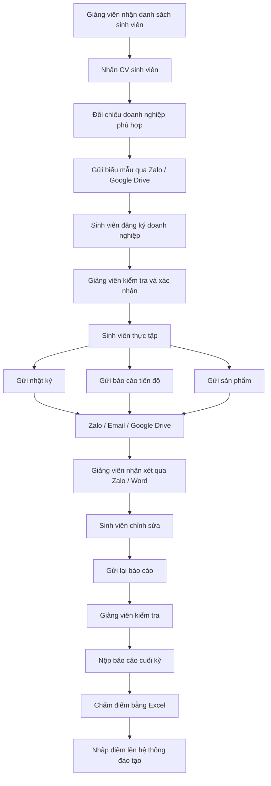

# AS-IS Business Workflow

```mermaid
flowchart TD

A[Giảng viên nhận danh sách sinh viên] --> B[Nhận CV sinh viên]
B --> C[Đối chiếu doanh nghiệp phù hợp]
C --> D[Gửi biểu mẫu qua Zalo / Google Drive]

D --> E[Sinh viên đăng ký doanh nghiệp]
E --> F[Giảng viên kiểm tra và xác nhận]

F --> G[Sinh viên thực tập]

G --> H[Gửi nhật ký]
G --> I[Gửi báo cáo tiến độ]
G --> J[Gửi sản phẩm]

H --> K[Zalo / Email / Google Drive]
I --> K
J --> K

K --> L[Giảng viên nhận xét qua Zalo / Word]

L --> M[Sinh viên chỉnh sửa]

M --> N[Gửi lại báo cáo]

N --> O[Giảng viên kiểm tra]

O --> P[Nộp báo cáo cuối kỳ]

P --> Q[Chấm điểm bằng Excel]

Q --> R[Nhập điểm lên hệ thống đào tạo]
```