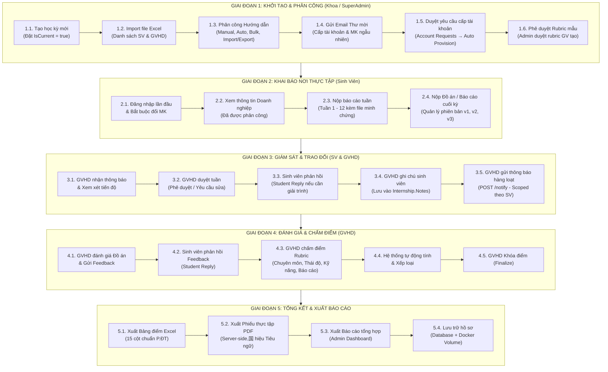

# Quy Trình Nghiệp Vụ Tổng Thể (Overall Business Workflow) — InternLink

**Dự án:** InternLink — Nền tảng Quản lý và Giám sát Thực tập Tốt nghiệp  
**Phiên bản:** 4.0  
**Giai đoạn:** 5 Giai đoạn khép kín từ Khởi tạo đến Tổng kết cuối kỳ

---

---

## 📌 Chi Tiết Từng Giai Đoạn

### Giai đoạn 1: Khởi tạo & Phân công
| Bước | Tác nhân | Thao tác | API |
|:---|:---|:---|:---|
| 1.1 | Admin | Tạo học kỳ, đặt IsCurrent | `POST /api/Admin/semesters` |
| 1.2 | Admin | Import Excel danh sách SV, GV | `POST /api/Admin/students/import` |
| 1.3 | Admin | Phân công GVHD cho SV | `POST /api/Admin/assignments/bulk-assign` |
| 1.4 | Admin | Gửi email thư mời | `POST /api/Admin/assignments/send-emails` |
| 1.5 | Admin | Duyệt yêu cầu tài khoản | `POST /api/Admin/account-requests/{id}/process` |
| 1.6 | Admin | Phê duyệt rubric GV | `POST /api/Admin/rubrics/{id}/approve` |

### Giai đoạn 2: Khai báo & Nộp bài
| Bước | Tác nhân | Thao tác | API |
|:---|:---|:---|:---|
| 2.1 | Student | Đăng nhập + Đổi MK | `POST /api/Auth/login` |
| 2.2 | Student | Xem thông tin DN | `GET /api/StudentPortal/me` |
| 2.3 | Student | Nộp báo cáo tuần | `POST /api/WeeklyReport` |
| 2.4 | Student | Nộp đồ án | `POST /api/Submission` |

### Giai đoạn 3: Giám sát & Trao đổi
| Bước | Tác nhân | Thao tác | API |
|:---|:---|:---|:---|
| 3.1 | Lecturer | Xem tiến độ | `GET /api/Lecturer/dashboard` |
| 3.2 | Lecturer | Duyệt tuần | `POST /api/WeeklyReport/{id}/review` |
| 3.3 | Student | Phản hồi bài nộp | `POST /api/Submission/{id}/student-reply` |
| 3.4 | Lecturer | Ghi chú SV | `PUT /api/Lecturer/internships/{id}/notes` |
| 3.5 | Lecturer | Notify hàng loạt | `POST /api/Lecturer/students/notify` |

### Giai đoạn 4: Đánh giá
| Bước | Tác nhân | Thao tác | API |
|:---|:---|:---|:---|
| 4.1 | Lecturer | Đánh giá đồ án | `POST /api/Submission/{id}/feedback` |
| 4.2 | Student | Phản hồi feedback | `POST /api/Submission/{id}/student-reply` |
| 4.3 | Lecturer | Chấm rubric | `POST /api/LecturerRubric/scores` |
| 4.4 | Lecturer | Finalize | `POST /api/Evaluation/{id}/finalize` |

### Giai đoạn 5: Tổng kết
| Bước | Tác nhân | Thao tác | API |
|:---|:---|:---|:---|
| 5.1 | Lecturer | Xuất Excel | `GET /api/Lecturer/export/end-of-term` |
| 5.2 | Student | Tải PDF | `GET /api/StudentPortal/internship-certificate` |
| 5.3 | Admin | Dashboard tổng hợp | `GET /api/Admin/dashboard/stats` |

---

## 📌 Lợi Ích Của Quy Trình Số Hóa

1. **Rút ngắn 90% thời gian xử lý hành chính**: Tự động hóa hoàn toàn các khâu gửi email, phân công, tổng hợp điểm.
2. **Trao đổi 2 chiều liên tục**: Giảng viên ghi chú, thông báo scoped; Sinh viên phản hồi bài nộp — tất cả lưu DB.
3. **Xuất báo cáo chuẩn mực**: PDF国 hiệu Tiêu ngữ, Excel 15 cột — Server-side, đảm bảo tính nhất quán.
4. **Minh bạch và truy vết**: Mọi thao tác đều được lưu với timestamp, version, và audit trail.
