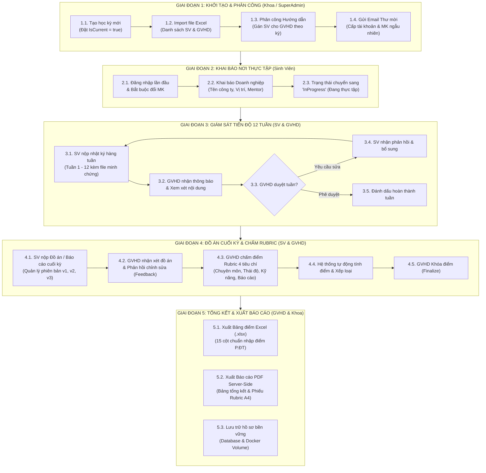

# Quy Trình Nghiệp Vụ Tổng Thể (Overall Business Workflow) — InternLink

**Dự án:** InternLink — Nền tảng Quản lý và Giám sát Thực tập Tốt nghiệp  
**Phiên bản:** 3.0  
**Giai đoạn:** 5 Giai đoạn khép kín từ Khởi tạo đến Tổng kết cuối kỳ

---

---

## 📌 Lợi Ích Của Quy Trình Số Hóa

1. **Rút ngắn 90% thời gian xử lý hành chính**: Tự động hóa hoàn toàn các khâu gửi email, phân công và tổng hợp điểm số.
2. **Minh bạch và chuẩn hóa**: Sinh viên nắm rõ tiến độ từng tuần và tiêu chí đánh giá chuẩn đầu ra.
3. **Truy vết lịch sử rõ ràng**: Mọi lần nộp bài, phản hồi và sửa đổi đều được lưu vết thời gian và phiên bản chính xác.
