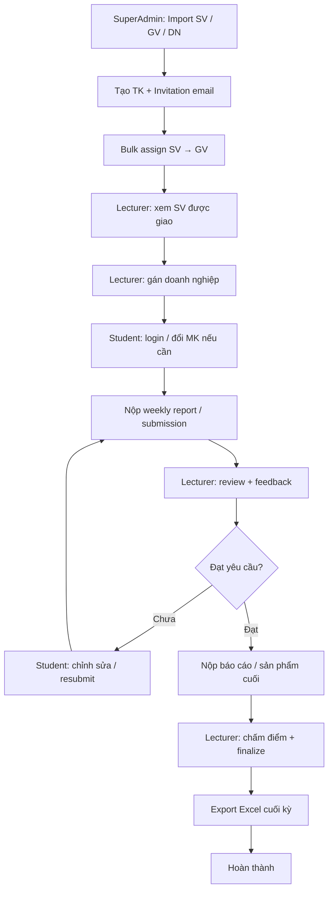

# TO-BE Business Workflow

**Version:** 2.0 — includes SuperAdmin ops

```mermaid
flowchart TD

  A0[SuperAdmin: Import SV / GV / DN] --> A1[Tạo TK + Invitation email]
  A1 --> A2[Bulk assign SV → GV]
  A2 --> B[Lecturer: xem SV được giao]
  B --> C[Lecturer: gán doanh nghiệp]
  C --> D[Student: login / đổi MK nếu cần]

  D --> E[Nộp weekly report / submission]
  E --> F[Lecturer: review + feedback]
  F --> G{Đạt yêu cầu?}
  G -- Chưa --> H[Student: chỉnh sửa / resubmit]
  H --> E
  G -- Đạt --> I[Nộp báo cáo / sản phẩm cuối]
  I --> J[Lecturer: chấm điểm + finalize]
  J --> K[Export Excel cuối kỳ]
  K --> L[Hoàn thành]
```

## Notes

- Phân công GV = SuperAdmin; gán DN = Lecturer.
- Sequence chi tiết: `docs/images/sequence/`.
