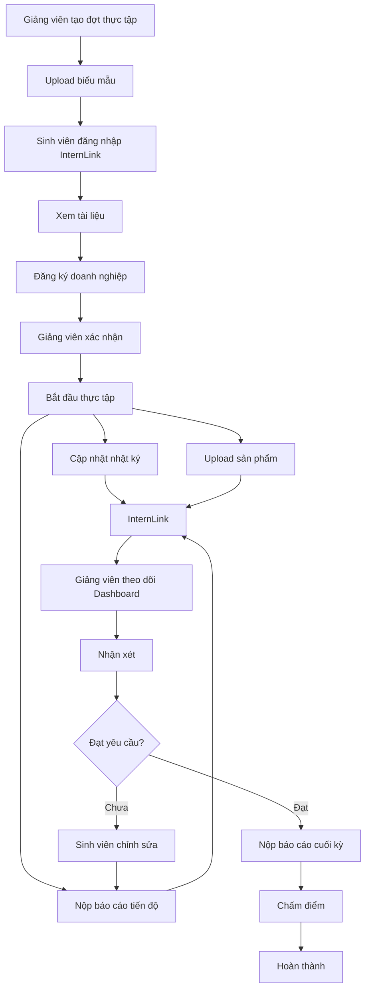

# TO-BE Business Workflow

```mermaid
flowchart TD

A[Giảng viên tạo đợt thực tập] --> B[Upload biểu mẫu]

B --> C[Sinh viên đăng nhập InternLink]

C --> D[Xem tài liệu]

D --> E[Đăng ký doanh nghiệp]

E --> F[Giảng viên xác nhận]

F --> G[Bắt đầu thực tập]

G --> H[Cập nhật nhật ký]

G --> I[Nộp báo cáo tiến độ]

G --> J[Upload sản phẩm]

H --> K[InternLink]

I --> K

J --> K

K --> L[Giảng viên theo dõi Dashboard]

L --> M[Nhận xét]

M --> N{Đạt yêu cầu?}

N -- Chưa --> O[Sinh viên chỉnh sửa]

O --> I

N -- Đạt --> P[Nộp báo cáo cuối kỳ]

P --> Q[Chấm điểm]

Q --> R[Hoàn thành]
```