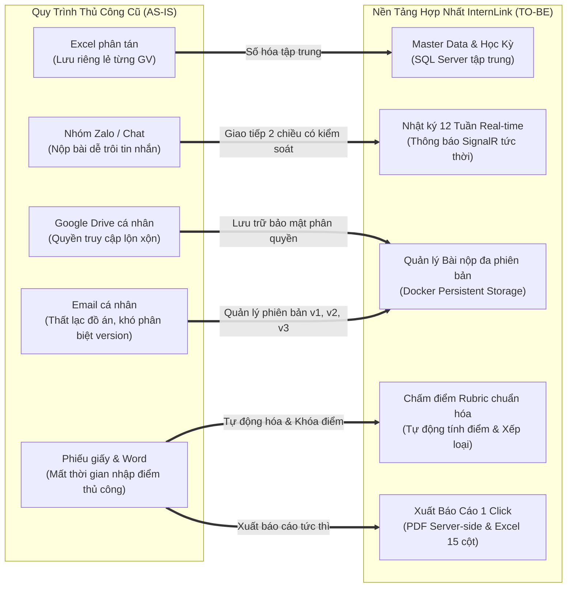

# So Sánh Quy Trình: Hiện Trạng (As-Is) vs Đề Xuất (To-Be) — InternLink

**Dự án:** InternLink — Nền tảng Quản lý & Giám sát Thực tập  
**Phiên bản:** 3.0

---

## 1. Sơ Đồ So Sánh Trực Quan

---

## 2. Bảng Phân Tích Hiệu Quả Cải Tiến Nghiệp Vụ

| Tiêu Chí So Sánh | Quy Trình Cũ (AS-IS) | Hệ Thống InternLink (TO-BE) | Mức Độ Cải Tiến |
| :--- | :--- | :--- | :---: |
| **Khởi tạo & Cấp tài khoản** | Nhập tay từng sinh viên (mất 2-3 ngày). | Import Excel hàng loạt, tự động sinh mật khẩu và gửi mail trong **10 giây**. | ⚡ **Nhanh gấp 50 lần** |
| **Theo dõi tiến độ tuần** | Hỏi đáp qua Zalo, dễ bỏ sót sinh viên nghỉ thực tập. | Cổng Dashboard 12 tuần trực quan, cảnh báo quá hạn tự động. | 🎯 **Giảm 100% sót báo cáo** |
| **Quản lý phiên bản đồ án** | Gửi nhiều file `baocao_final_v2_sua.docx` qua email. | Hệ thống quản lý phiên bản rõ ràng (`v1.0`, `v2.0`), kèm lịch sử nhận xét. | 🛡️ **Tuyệt đối không nhầm bài** |
| **Tính toán & Tổng hợp điểm** | GVHD tính tay, Khoa mất 1-2 tuần nhập điểm giấy. | Hệ thống tự tính theo trọng số Rubric, xuất Excel/PDF với **1 click**. | ⏱️ **Tiết kiệm 95% thời gian** |
| **Chi phí hạ tầng lưu trữ** | Tốn chi phí mở rộng Google Drive hoặc Cloud Storage. | Sử dụng Local Docker Volume an toàn trên máy chủ nội bộ. | 💰 **0đ chi phí phát sinh** |
